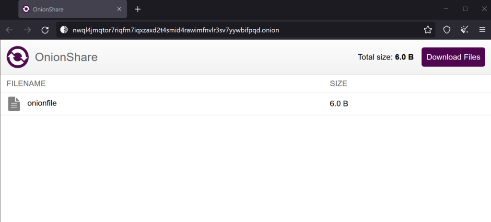

First off if you're unfamiliar with Tor. Please visit [https://www.torproject.org/](https://www.torproject.org/) for more information.

We'll be using [OnionShare](https://onionshare.org/) to transfer the files.

I will be using two Linux machines. One running Kali Linux and the other running Ubuntu 20.04.4 LTS.

## Installation

We'll need to install OnionShare on the machine that will be sending the file. In this case, it will be Ubuntu.

I'll be installing OnionShare using the [Snap](https://snapcraft.io/about) package manager.

sudo apt install snapd
systemctl enable --now snapd apparmor

Next, we'll install OnionShare.

sudo snap install onionshare

OnionShare can be used via the GUI. However, I will be using the CLI.

Let's create a new file that will be shared later on.

echo "HELLO" > onionfile

Now, all we need to do is start OnionShare and pass the file as the first argument.

onionshare.cli onionfile

We can now access the file from any other machine through tor using the .onion address with the provided private key.

Go ahead and launch the [Tor browser](https://www.torproject.org/download/) on the Kali pc. Copy/paste the .onion address into the URL.

Type in the private key.

Download the file and check its contents.

We've successfully transferred the file over Tor!
